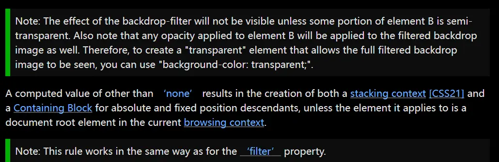
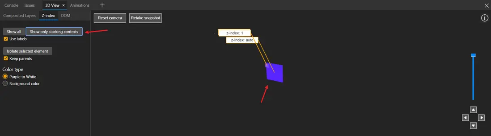
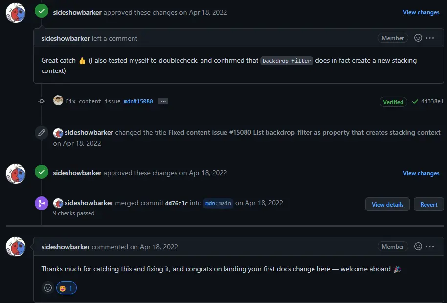
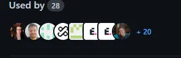

## 一、前言
up主2019年毕业，找了一份前端工作，一直干到现在。2019年末出现疫情，三年的时间，也差不多与我的职业生涯完全重合了。刚过去的2022年，我也没有避开阳的命运（这病毒是真的强），就12月这一个月时间，几乎全公司都沦陷了。而就在我卧病等待阳康的日子里，新闻上不断播放着某某30岁年轻人死于新冠，某某医生死于新冠等噩耗。我有点慌了，不是以前那种感慨一下就抛掷脑后的感觉，而是真的开始想象自己哪天会不会突然被这病毒干死。

至此，我带着些许惶恐开始回忆这一年我做的事情，工作上的、生活上的、感情上的。这一年我确实选择了做更多自己感兴趣的事，但结果有好有坏。生活似乎真的就像无情的怪兽，它总会见缝插针地夺走一些你珍视的东西。但也会像圣诞老人一样，带给你一些意想不到的礼物。

## 二、拥抱开源
前端人一定是对开源最重视的人群之一。整个前端的生产力基本上都被开源项目包揽了。作为一个前端，可能超过一半的时间都是在用或者研究别人的库和框架。也就是说，你职业生涯可能花了一大半的时间在别人的开源项目上。

值得一提的是，2022年我参与了一些自认为比较有意义的开源项目，并且也帮助了一些人。

### MDN

[MDN](https://developer.mozilla.org/zh-CN/docs/Web/Guide)可以说是前端工程师的百科全书了，我自己也经常在里面去查一些知识点和API。

机缘巧合，在一次使用CSS属性**backdrop-filter**的时候，我发现元素竟然出现了层级不对的情况。通俗点说就是明明感觉应该是A元素在上面，B元素在下面，但却是A被B覆盖了。于是想不明白的我就去MDN查资料，主要就是[层叠上下文](https://developer.mozilla.org/zh-CN/docs/Web/CSS/CSS_Positioning/Understanding_z_index/The_stacking_context)的知识点。而在MDN列出的属性中，并没有说明backdrop-filter会形成层叠上下文。于是我只好去W3C查backdrop-filter属性的内容，找到了如下一句话:

> A computed value of other than none results in the creation of both a stacking context [CSS21] and a Containing Block for absolute and fixed position descendants, unless the element it applies to is a document root element in the current browsing context.
Note: This rule works in the same way as for the filter property.

意思就是这个属性同filter一样，会创建层叠上下文。OK，至此应该就破案了，MDN并没有把这个属性列出来。为了验证这个说法是否真的是正确的，于是我又打开了Edge的3D View功能，里面可以清楚地看到当前页面所有元素的层叠情况。果然不出我所料，同W3C描述一致。

于是我就给MDN提了一个issue，告诉了他们我的想法，然后提了Pr提交了修正的内容。
官方人员回复如下:

内容是说他们也亲自测试了一遍，确实如我所说，感谢我能发现并fix这个问题。

虽然并不是非常大的贡献，但我相信很多和我一样遇到这个问题的人，再次去查MDN的时候，他们就能了解其原因并解决他们的问题了。

### Parcel
[parcel](https://parceljs.org/)应该也有不少小伙伴用过或者听过，是一个非常简洁和快速的前端构建工具，用途和Webpack、Vite差不多。我是在开发浏览器插件的时候，开始使用这个构建工具进行开发的。

在开发插件的过程中，我发现一个小问题，就是parcel打包出来的文件总是会带上hash值，并且还是无法去掉的。官方的解释是为了更好的优化和浏览器缓存策略。但是开发过插件的小伙伴应该都知道，在manifest.json文件中，我们需要给一个固定的文件名称，所以如果文件名中会带上随时变化的hash值，显然是不可行的。于是我去翻阅了下parcel的文档，发现支持自己编写parcel插件，可以自行处理文件名称。为了避免重复造轮子，我想应该有别人写好的插件了吧，但是我翻了一圈没找到有用的。想了想干脆自己写一个吧。于是写了一个插件叫[parcel-namer-hashless](https://github.com/gxy5202/parcel-namer-hashless)，并且发布到了NPM上。我也为此写了一篇文章讲解如何去掉parcel文件的hash值
> [利用插件去掉Parcel2打包文件的hash值](https://segmentfault.com/a/1190000041346201)

果然有人和我遇到相同的问题，慢慢开始有其他人开始使用这个插件，现在github上已经有28个仓库在使用这个插件。用的基本上都是老外，国内用parcel的人还是很少的。

这个过程中还发生了一件有趣的事，我在parcel官网搜索插件的时候，发现有天官网进不去页面了。进去就报错，于是我去提了个issue，并且把parcel官网的代码拉了下来，发现是一个请求的参数错误导致页面报错，无法渲染。然后提了Pr，顺理成章成了Parcel官网的贡献者。

这两个是我认为最值得分享的参与开源项目的经历，也是比较有意义的。

如果思否也算开源的一部分的话，2022获得了第三季度的**TopWriter**也是我认为比较有意义的一件事。伤心的是思否寄给我的纪念品被被人偷走了。

## 三、开始创造
前端们一定都很羡慕尤雨溪这种程序员吧，准确的说是创造者。他们创造新的东西，打造自己的产品和声望，同时还能挣不少的钱。

其实我一直很羡慕那些独立开发者，他们不仅有技术，有执行力，更有别人不具备的想法和创造力。我是只有一点技术，也有一点想法和创造力，但执行力一般般，综合起来就觉得自己可能并不能成为一个独立开发者。但是也不能一棒子打死自己吧..

2022年4月，我将自己写的浏览器插件发布到了**Chrome Web Store**上，名叫[Video Roll](https://gomi.site/VideoRoll)。

本来这只是我自己看视频用来解决一些视频体验问题的插件，而且本身功能就很小众，应该是个需求量非常小的功能。但是我还是想着迈出第一步，把它作为一个产品来打造。想法就是开源+发布到插件市场。于是我找来好朋友兼同事，帮我设计了一个比较漂亮的logo。然后我开始打磨这个小插件。从UI配色、交互，到单元测试、官网，我都一人做完。成功发布后的一个月内，基本上没什么人用，这也在我的预料之中，毕竟功能这么小众。接着到了7月份左右，开始每个月有200个左右的用户增长了。到了年底，已经有了**2000**多个用户。我开始也觉得2000个也不多啊，但是直到我去查看了Chrome的官方统计，用户超过1000的插件数竟然不到10%时，我就有点开心了。并且插件还收获了非常多的好评，谷歌5分的满分，我的用户让我一直维持在4.9左右。然后在10月份，获得了**Chrome**官方认证的**精选插件**, 还进入过几次“效率”类插件的推荐页。说实话，从最开始对这个小产品的预期来说，这波确实已经出乎了我的意料。虽然开源过后github star并不多，但作为一个浏览器插件，周活用户已经足够说明它是个有意义的产品了。我也写过一篇文章介绍它：
> [Video Roll升级，一款小众浏览器插件优化你看视频的体验](https://segmentfault.com/a/1190000042571364)

我还给它做了一个年终总结

这个经历也让我更加坚定了自己做产品的决心，2023年我会打造一个从大学开始就很想做的东西，是个与音乐视频相关的东东，也希望能帮助更多的人。这个过程中如果能挣点外快当然是更好的，到时候再来思否和大家分享。

这里和大家分享一句B站游戏UP主描述《我的世界》中说的话“如果创造比竞技更有趣，那为何创造不能成为游戏的主体？”

## 四、看开工作
2022之前的我，经常会为了几个bug搞得心烦意乱，满脑子都是任务期限、需求、问题单等等。工作在无形之中给了我一些压力，让我觉得本来挺感兴趣的职业，有时候竟然这么烦人。但是2022之后，我慢慢开始调整了心态，不再去纠结于那些零零散散的bug，不再去纠结于任务排期，不再去纠结于频繁变更的需求。这让我慢慢从工作的泥潭中挣脱了出来，把它当作工作和职业，工作中你就是打工者，你是来挣钱的，所以就要按照别人的要求来。想通了这点，工作中遇到的任何问题都不是问题了，能解决的就解决，实在无力解决的，换个地方即可。

## 五、享受生活
大学毕业后就几乎没怎么玩过游戏的我，在阳了之后，竟然在Steam上花了几大百买了游戏。嗯，空闲时间我开始玩游戏了。当我再次进入游戏世界的时候，才发现原来我已经快两年没有这样一个人如此认真地玩游戏了。那种心无旁骛、毫无杂念，只想做任务通关的感觉，像极了刚开始做前端，愿意花一个通宵来调CSS样式的感觉。那种做完任务后，立刻想开始探索下一个关卡的感觉。

这是工作很难带来的感觉，是只有去玩游戏、去运动、去旅游、去看电影，才能有的兴奋和幸福感。当我们处在这个保持健康都成为问题的社会中时，让自己开心才应该是生活的主旋律。希望看到这篇文章的朋友们也能保持健康，多多享受生活。

本文参与了 [SegmentFault 思否年度征文「一名技术人的 2022」](https://segmentfault.com/a/1190000042923114)，欢迎正在阅读的你也加入。