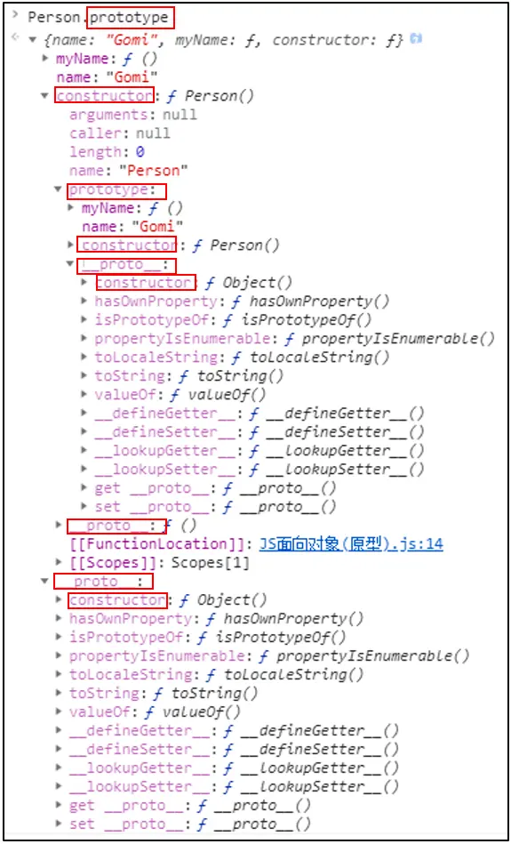
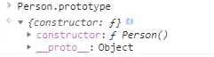
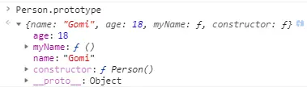
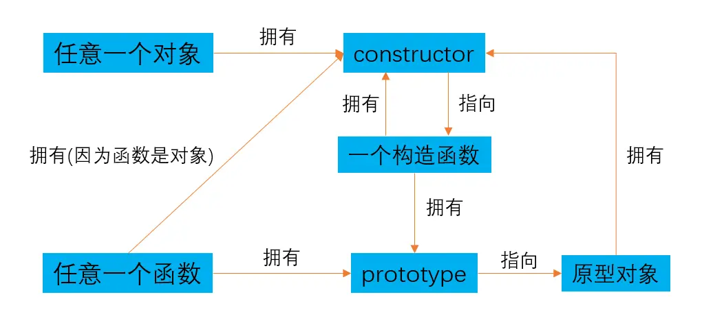
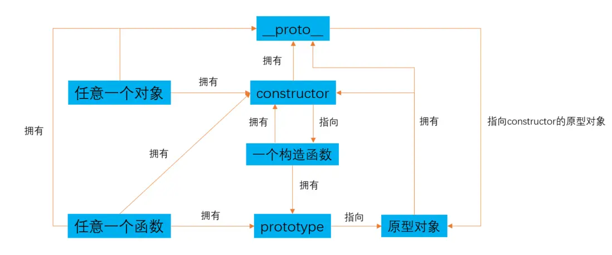

前言
==
先说一说为什么要搞清楚JavaScript的原型，因为这就是JS的根。JavaScript虽然不是一门传统的面向对象语言，但它有自己的类和继承机制，最重要的就是它采用了原型的概念。与其说JS是面向对象，不如叫面向原型。JS这门语言从开发之初就是基于原型去做事情的，它是面向对象的思想，但归根结底是面向原型的原理，从操作上来说也是这样的。

我们老师以前说过，好多工作几年的人，在这个问题上都模棱两可。基础才会是决定一个程序员上限的最终指标。因为对一门语言的基础掌握得越好，就越可能通过原生的语言去开发新的东西，框架也好、插件也好。但如果基础不好，顶多也就能用用别人开发的东西，你自己是没能力去开发的。

那么要搞懂原型，涉及到的知识点就比较多了，构造函数、指针、对象、继承这些概念都会是门槛，但不要着急，一口是没法吃成大胖子的。我在翻阅研究《JavaScript高编》和各种资料后，总结出了自己对这部分的理解，尽量用连贯性和通俗易懂的方法去解释，这样方便自己的记忆，相信大家看了也不会懵逼。

原型模式
=====

原型的概念
-----

那么到底什么是原型呢？原型的英文就是“prototype”。记住这个朋友，它会伴随我们的一生，不离不弃。

**维基百科的官方解释**：
原型模式是是面向对象编程的子系统和一种方式，特点在于通过“复制”一个已经存在的实例来返回新的实例，而不是新建实例。被复制的实例就是我们所称的“原型”，这个原型是可定制的。
维基百科：https://zh.wikipedia.org/wiki/%E5%8E%9F%E5%9E%8B%E7%A8%8B%E5%BC%8F%E8%A8%AD%E8%A8%88

通俗地讲，原型就是我们复印件的原件。

那么JS里的原型是什么呢？**“我们创建的每个函数都有一个`prototype`属性，这个属性是一个*指针*，指向一个对象，而这个对象的用途是包含可以由特定类型的所有*实例*共享的属性和方法。”**原型就是这句话中的`prototype`，说白了它就是一个对象`{}`，叫原型对象。

抓重点：
1.每个函数才有`prototype`属性，即`function abc(){}`,`abc.prototype`是存在的！
2.`prototype`是一个指针，指向一个对象。（指针什么意思？下面解答）
3.`prototype`指向的对象可以让其他实例共享其属性和方法。

这里的第二点，**指针**到底是个什么意思呢？比如`var a = [1]`，指针就是指向等号右边这个数组在计算机内存中的存储地址。所以当我们使用`a`的时候，`a`就是一个指针，它指向`[1]`存储的地方。说得通俗点，就是通过`a`这个变量，我们可以找到等号右边这个值。

`prototype`就是指向一个对象存储的地方，可以理解为我们去找到`prototype = {}`中等号右边这个值，所以最终返回的就是一个对象。

原型模式和构造函数模式的区别
--------------
但是我们在JS中创建新的对象会有两种模式，一种是构造函数模式，一种就是原型模式。这个构造函数也是new一个实例，他们有什么区别呢？先看下面这段代码：
```
/*
原型模式
*/

function Person(){};  //新建一个空函数

Person.prototype.name = 'Gomi';  //为它的原型添加属性
Person.prototype.myName = function(){
    console.log(this.name)
};

var gomi = new Person();  //复制一个Person实例
var gomi2 = new Person();  //再复制一个Person实例

gomi.myName === gomi2.myName  //true,说明他们的this都是指向同一个原型，即Person.prototype。

/*
构造函数模式
*/
function Animal(){
    this.name = 'cat',
    this.myName = function(){
        console.log(this.name)
    }
};  //新建一个函数，并直接在里面添加属性和值

var jack = new Animal();  //同样实例化了一遍，但这时每个实例中的属性和值都是独立存在的。
var jack2 = new Animal(); 

jack.myName === jack2.myName //false,说明他们的this指向不同，都是单独生成的新的实例，而不是依赖于同一个原型。
```

**原型和构造函数**的区别就像**影分身和克隆**的区别。我们把原型模式看作影分身，复制原型的过程看作本体产生分身的过程，影分身的任何动作都是基于那个唯一本体的，他做什么，影分身就会做什么。而构造函数模式就是克隆，虽然克隆的时候是基于唯一本体的基因，但其实克隆出来的每个人都是一个新的独立的人了，他们虽然长得一模一样，但互相之间没有任何关联。如果本体整容了，其余的克隆人也不会变。但在本体整容后再进行克隆的人，肯定就会跟整容后一样咯。而影分身是，一旦本体整容，那么所有分身都会跟着变样。

搞清了构造函数和原型的区别后，就可以继续了。

constructor、prototype、__proto__的关系
----------------------------------
光是搞清楚构造函数和原型的区别还远远不够，我们经常会在控制台看到下面这种结构：



这是一个绝对能够搞晕你的结构，我圈出的constructor、prototype、__proto__这三者总是在出现，总是在互相嵌套。他们到底是什么关系？又代表什么意思呢？

首先搞清楚他们所代表的含义：
1.`constructor`：指向构造这个对象的**函数**。
2.`prototype`：函数的原型对象**（上面提到，只有函数才有）**。
3.`__proto__`：指向构造函数的原型对象，存在于实例与构造函数的原型对象之间。**（只要是对象就有这个属性，所以函数也会有。注意这是一个非标准的属性，所以大多数人叫隐式属性，但是现代所有浏览器都支持访问）**
如果不好理解，一个一个来。

**constructor**

`constructor`的官方定义是**“返回创建该对象的函数的引用”**。
说白了就是找到这个对象是通过什么构造函数来生成它的，通过`constructor`就能找到这个函数。

直接声明一个对象时（广义的对象），它的`constructor`：
```
//定义对象
var obj = {a:1};
obj.constructor;//输出Object(){}，说明生成obj的上层函数是Object(){}这个函数
obj.constructor.constructor; /*输出Function(){}，因为在JS中函数也是对象，所以Object()这个函数对象上层构造它的函数是Function(){}*/
obj.constructor.constructor.constructor;//还是输出Function(){}，说明Function(){}就是最顶层的构造函数了

//定义函数对象
var func = function(){};
func.constructor;//输出Function(){}

//定义数字对象
var num = 1;
num.constructor;//输出Number(){},说明上层生成这个数字对象的函数是Number(){}
num.constructor.constructor;//输出Function(){},最顶层的函数
```
当这个对象是`prototype`原型对象时，它的`constructor`：

```
function Person(){};
Person.prototype.name = 'Gomi';
Person.prototype.constructor;//输出Person(){}
Person.prototype.constructor.constructor;/*输出Function(){}，最上层的函数。*/

```
记住一点就行，`constructor`是找到我们JS中生成这个对象上层的构造函数是什么。**万物皆对象**，如果定义一个字符串，那么它的上层函数就是`String(){}`，如果定义一个数组，它的上层函数就是`Array(){}`......一直找到最上层就是`Function(){}`。

**pototype**

`prototype`就是我们说的原型对象，只有函数才有这个属性。
所以当我们随便定义一个函数时，都会自带这个属性。
```
function Person(name,age){
    console.log('hello')
}
```
`Person.prototype`输出如下图：


返回的是一个对象，由于我们没有给`prototype`添加任何属性，所以除了`constructor`这个属性，我们找不到其他属性了(其他属性继承于Object())。
现在我们给它添加属性：

```
Person.prototype.name = 'Gomi';
Person.prototype.age = 18;
Person.prototype.myName = function(){
    console.log(this.name)
}
```
这时`Person.prototype`的输出结果如下：


现在我们`new`一个实例看看：
```
var gomi = new Person();
gomi.name;//输出'Gomi';
gomi.name = 'hi';
gomi.name;//输出'hi'
```
从上面的结果可以看出来，这个机制是会先去找实例本身的属性，如果存在就直接返回实例的属性，如果不存在再去原型里找。所以当你给实例添加了一个和原型相同的属性时，从表面上看就是覆盖了原型的属性，因为我们不能直接通过实例这个属性去返回原型的属性了，但实际上实例和原型的这两个属性都是单独存在的。

好了，那么我们为什么要用这个`prototype`呢？因为我们开头说到的，可以供其他实例共享这些属性。比如有这样一个场景，我们现在的`Person`实例存的是公司的人员信息模板，现在归类，将公司名称和员工类型作为属性，符合这一类的员工我们就生成一个实例。那么我们就可以像下面这样生成全部公司的员工类型，每个人一个实例：
```
function Person(){};
Person.prototype.company = 'sefon';
Person.prototype.type = 'inter';
var Anna = new Person();
var Gomi = new Person();
var Lily = new Person();
...
//生成的这些实例就都具备Person的属性了，这些人就都是我们的inter实习生
```
那要是我们现在要给每个员工新增一个职位的属性怎么办呢？难道我们要给每个实例添加一遍吗？

```
Anna.job = 'front-end';
Gomi.job = 'front-end';
Lily.job = 'front-end';
...
```
这样太麻烦了，于是我们`prototype`的作用就来了，只需要`Person.prototype.job = 'front-end'`就行了，所有实例会自动继承我们的`Person`所有的属性和值。当然这样肯定也是有弊端的，就不多说了。

**要注意**的是当我们使用下面这种将整个`prototype`重写的情况时，会切断构造函数和原型之间的联系，也就是说`constructor`不再指向`Person(){}`了，而是指向`Object(){}`。

```
function Person(){};
Person.prototype.constructor; //输出Person(){}
Person.prototype = {
    name:'Gomi'
}
Person.prototype.constructor; //输出Object() { [native code] }
```

那么`prototype`和`constructor`是个什么关系呢？
上面已经提到一些，`constructor`是找我们对象的构造函数是什么，返回的是一个函数。`prototype`是函数才有的原型对象。于是乎，`constructor`是不是有`prototype`呢？答案当然是有的。那`prototype`是个对象，里面肯定也有`constructor`咯。

他们的关系我画了一个简洁版的关系图如下：


**__proto__**
`__proto__`是个非标准属性，但是很重要。它就像一根链条，将我们JS对象连接起来。那么它到底是个什么东西呢？
首先，`__proto__`是连接于实例与构造函数原型之间，而不是实例与构造函数之间的。什么意思呢？举个例子：

```
function Person(){};
Person.prototype.name = 'Gomi';
var gomi = new Person();
gomi.constructor; //输出Person(),gomi实例的构造函数是Person()
gomi.__proto__ ; //输出{name:'Gomi',constructor:f}
gomi.constructor.prototype; //输出{name:'Gomi',constructor:f}
gomi.constructor.prototype === gomi.__proto__ ; //返回true,说明gomi.__proto__指向的是gomi构造函数的原型
```

当`__proto__`一层一层最终指向的是`Object()`这个构造函数的原型时，`__proto__`就是`null`。所以大家常说的原型链最顶端是null就是这么来的。比如下面这样：

```
function Person(){};
Person.__proto__;//输出ƒ () { [native code] }
Person.__proto__.__proto__//输出{constructor: ƒ, __defineGetter__: ƒ, __defineSetter__: ƒ, hasOwnProperty: ƒ, __lookupGetter__: ƒ, …}
Person.__proto__.__proto__.__proto__;//输出null
```

上面的代码就说明了`__proto__`指向的是实例的构造函数的原型，记住是`xxx.constructor.prototype === xxx.__proto__`就行了。所以他们的关系用图来表示就是下面这样：



**说明：**图可能画得不是很好，这里我单独把指向的对象写了出来，比如`constructor`返回的是一个构造函数，也就是说其实`constructor`就是一个构造函数，只是为了更加清晰，我便单独把返回的东西用指向来说明。

本文仅作为自己的学习和总结，如有错误请直接评论，我会修改的哈哈。

如果觉得还不够明白或讲得不好，可以看看更加权威的：
https://developer.mozilla.org/zh-CN/docs/Learn/JavaScript/Objects/Object_prototypes
