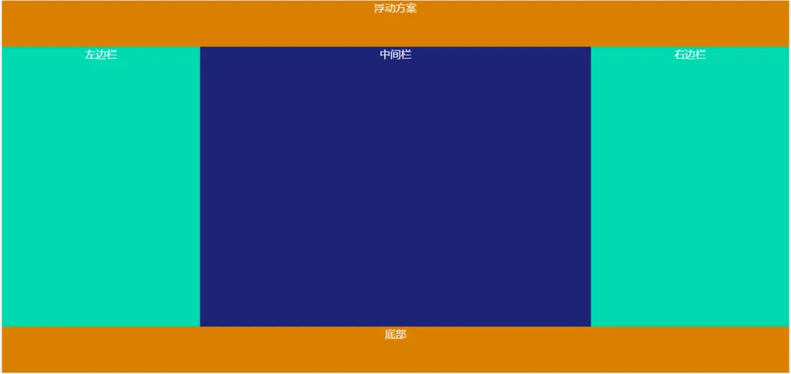
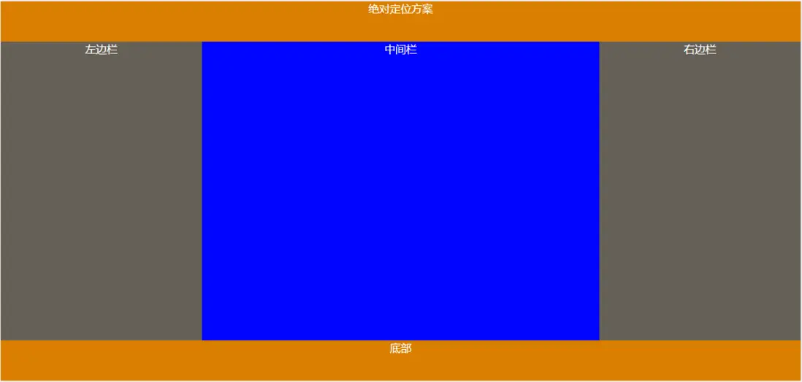
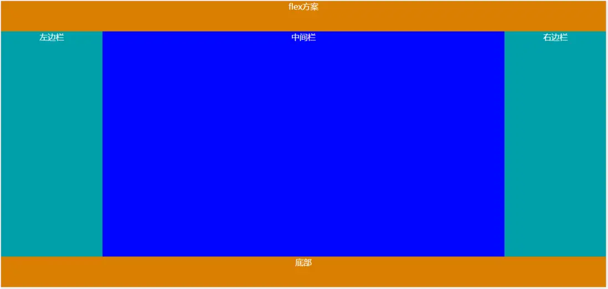

前言
==
大家总是听到双飞翼布局和圣杯布局...也不知道是谁取的名字，我就叫三栏布局吧。虽然他们有些细微的区别，但本质上都是实现一个三栏布局，即左右两栏固定，中间自适应。

实现方案
==
网上随便一搜，全是实现方案，少到两三种，多到七八种。各种方法都有优缺点，但我觉得比较实用的方法主要就那三四种，因为很多方法其实是被淘汰的或者说太麻烦（如表格布局）。

 - **浮动方案**
 - **绝对定位方案**
 - **flex布局方案**
 - **网格布局（本章不讲）**

方案一：浮动方案
------------
**实现思路：**
先将左右两栏进行浮动，左边栏向左浮动，右边栏向右浮动就能固定在两边。但是要注意一点，这种方法要将中间栏放在最后，因为如果将中间栏放在中间，并且没有对自身进行浮动的话，会占据文档中的位置，导致右边栏并不能完全和左边栏平齐。

**HTML：**
```
    <!-- 三栏布局 浮动定位-->
    <div class="layout">
        <header>头部</header>
        <main>
            <div class="left">左边栏</div>
            <div class="right">右边栏</div>
            <div class="center">中间栏</div>
        </main>
        <footer>底部</footer>
    </div>
    <!-- 三栏布局 浮动定位-->
```
**SCSS:**

```
//浮动布局
.layout {
    color:white;
    text-align: center;
    height: 100%;
    overflow: hidden;
    header,footer{
        width: 100%;
        height: 70px;
        background: rgb(202,132,2);
    }
    footer {
        position: absolute;
        bottom: 0;
    }
    main {
        width: 100%;
        height: 100%;
        background: red;
        .left,.right {
            width: 300px;
            height: 100%;
            background: rgb(14, 214, 171);
        }
        .left {
            float:left;
        }
        .right{
            float:right;
        }
        .center {
            height:100%;
            background: rgb(26, 26, 122);
        }
    }
    
}
```
**效果：**



**缺点：**
浮动元素会脱离文档流，如果在`<main>`的内部还有其他元素，有可能会因为父元素的高度塌陷而导致问题。所以要么给父元素设置高度，要么就要清除浮动了。

方案二：绝对定位方案
----------
**实现思路：**
将左右两栏进行绝对定位，固定在左右两边，中间栏通过左右margin距离来适应宽度。同样，这种方法要注意中间栏在HTML结构中的位置，如果中间栏在中间，那么中间栏也要进行绝对定位，如果在最后面则不需要进行绝对定位。

**HTML：**

```
    <!-- 三栏布局 绝对定位-->
    <div class="layout">
        <header>绝对定位方案</header>
        <main>
            <div class="left">左边栏</div>
            <div class="right">右边栏</div>
            <div class="center">中间栏</div>
        </main>
        <footer>底部</footer>
    </div>
    <!-- 三栏布局 绝对定位-->
```
**SCSS：**

```
// 绝对定位布局
.layout {
    color:white;
    text-align: center;
    height: 100%;
    overflow: hidden;
    header,footer{
        width: 100%;
        height: 60px;
        background: rgb(202,132,2);
    }
    footer {
        position: absolute;
        bottom: 0;
    }
    main {
        width: 100%;
        height: 100%;
        background: red;
        position: relative;
        .left,.right{
            position: absolute;
            width: 300px;
            height: 100%;
            background: rgba(100, 96, 87,0.5);
        }
        .left {
            left:0
        }
        .right {
            right:0;
            //top:0;
        }

        .center {
            height: 100%;
            margin:auto 300px;
            left:0;
            right:0;
            background: blue;
        }
    }
    
}
```
**效果：**



**缺点：**
绝对定位同样会脱离文档流，如果其他元素位置有要求的话，需要继续设置定位。

方案三：Flex方案
----------
**实现思路：**
弹性布局十分简单，给最外层的父级元素设置为弹性盒子，然后设置两端对齐，中间栏的宽度设为100%即可。

**HTML：**

```
    <!-- 三栏布局 flex布局-->
    <div class="layout">
        <header>flex方案</header>
        <main>
            <div class="left">左边栏</div>
            <div class="center">中间栏</div>
            <div class="right">右边栏</div>
        </main>
        <footer>底部</footer>
    </div>
    <!-- 三栏布局 flex布局-->
```
**SCSS：**

```
//flex布局
.layout {
    color:white;
    text-align: center;
    height: 100%;
    overflow: hidden;
    header,footer{
        width: 100%;
        height: 60px;
        background: rgb(202,132,2);
        text-align: center;
    }
    footer {
        position: absolute;
        bottom: 0;
    }
    main {
        width: 100%;
        height: 100%;
        background: red;
        display:flex;
        justify-content: space-between;
        .left,.right {
            width: 300px;
            height: 100%;
            background: rgb(18, 157, 167);
        }
        .center {
            width: 100%;
            height:100%;
            background: blue;
        }
    }
}
```
**效果：**



**缺点：**
flex是CSS3才有的，浏览器兼容性最低到IE8。
