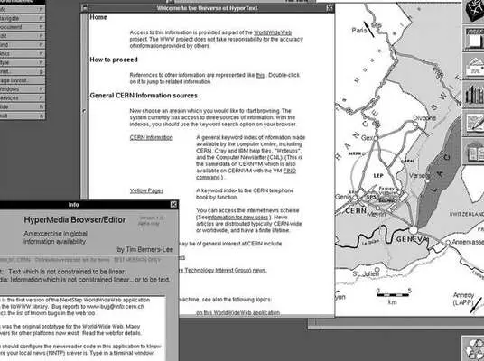
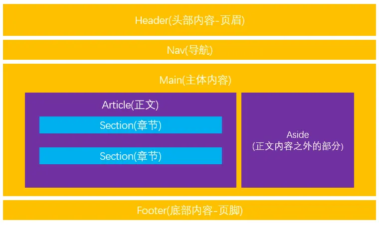
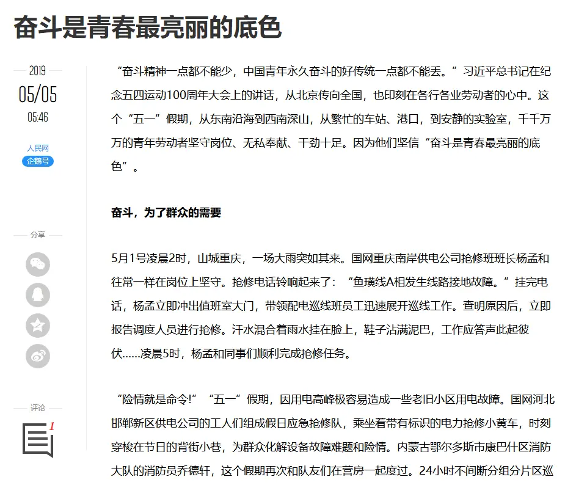
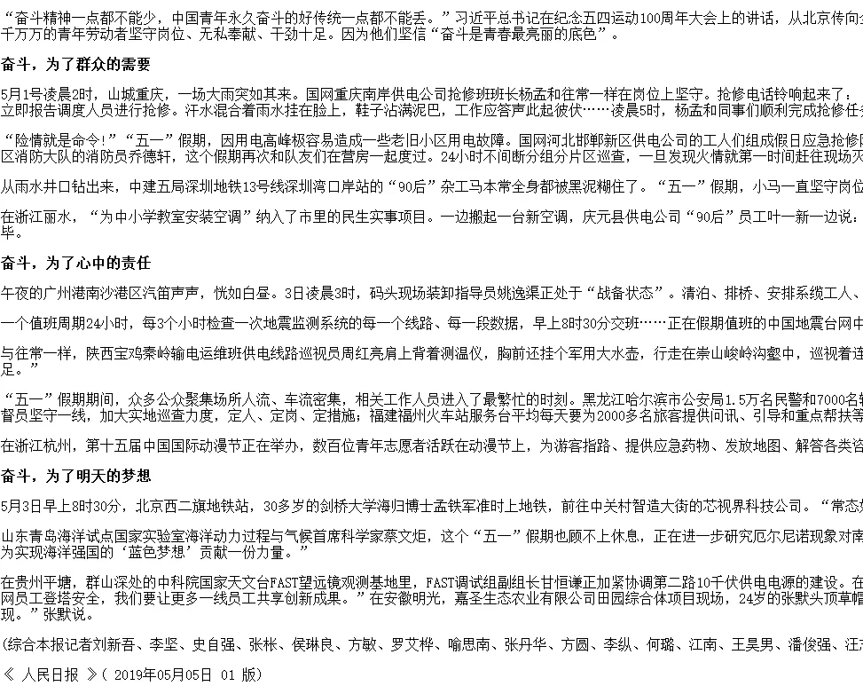
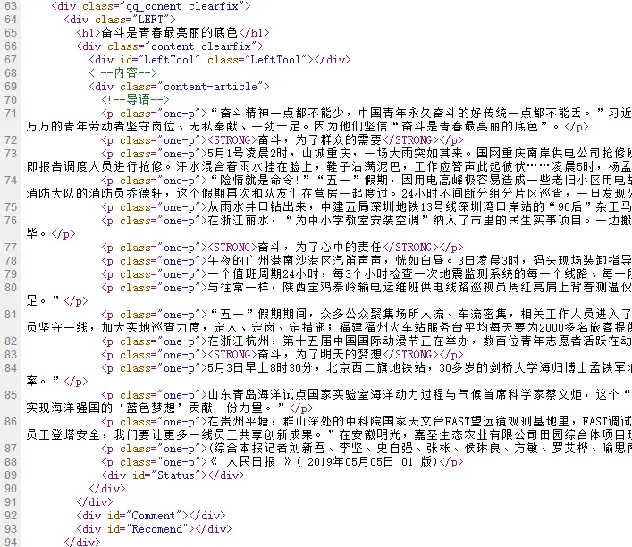

HTML语义化
=======

概念
--
**官方解释：**
语义化是指用合理的HTML标记以及其特有的属性去格式化文档内容。通俗地讲,语义化就是对数据和信息进行处理,使得机器可以理解。

**我的理解：**
在我的理解中语义化就是让我们写的每一行代码都有其意义，不仅仅是程序实现和功能上而言，还必须能被人和机器很好的理解。简单的说就是你写的代码应该是两全其美的，既要让人读懂也要让机器读懂。在HTML中就是告诉大家，每一个标签都是有它独特的意义的和应用场景的，而不是随便想用就用，想用什么替换就用什么替换。

我认为最好的理解就是将office中的Word与其对比。Word中从头部页眉、标题、正文再到页脚都有单独的样式和设置，所以HTML也大同小异，就是为了将网页内容通过这些设置来呈现出来。包括我现在写的文章是用Markdown来完成的，也是语义化的体现。

我将HTML的语义化分为两部分，一个是结构语义化，一个是标签语义化，虽然这样分会有点问题，但更有利于理解。

结构语义化
--

先从网页的整个结构来说，最早的网页就是来展现最基础的新闻、文章之类的，只是现在的网页设计更厉害了，在样式上看着更加炫酷和多样化，但本质上都是从最基本的结构做起的。可以先看看世界上最早的网页是什么样子：




一般来说我们网页的结构大致上可以从下面这个图来理解（当然布局是可以改变的）：



**代码展现：**

```
<body>
    <!-- 头部 -->
    <header></header>
    <!-- 头部 -->

    <!-- 导航 -->
    <nav></nav>
    <!-- 导航 -->

    <!-- 主体内容 -->
    <main>
    
        <!-- 正文内容 -->
        <article>
            <!-- 章节 -->
            <section>
                <p></p>
            </section>
            <!-- 章节 -->
        </article>
        <!-- 正文内容 -->

        <!-- 正文之外内容 -->
        <aside></aside>
        <!-- 正文之外内容 -->
        
    </main>
    <!-- 主体内容 -->

    <!-- 底部 -->
    <footer></footer>
    <!-- 底部 -->
</body>
```

标签语义化
-----
结构语义化不也就是将标签语义化吗？是的，但是单独拉出来说是因为除了整个网页结构，其他更多的细节我们需要注意语义化。举个例子,下面是**腾讯**某新闻版块的网页：



现在我们**去掉其所有样式**后是这样的：



再看看它的**源代码**：


不难发现，在我们将其网页的所有样式都去掉之后，还是能清晰地读完整篇文章，并且是层次分明的。这就是为什么要将标签语义化。可以看到文章的标题用到了`<h1>`标签，全文就这一个大标题。然后整篇文章用`<p>`标签将文段分开，没有用`<div>`，因为`<p>`就代表一个段落，而`<div>`什么都不代表。强调的部分用了`<strong>`标签。大家知道CSS中的`font-wight`也可以加粗文字，HTML的`<b>`标签也可以加粗文字，但是腾讯都没有使用。因为CSS在没有样式的时候就不管用了，`<b>`标签没有强调的意思，而`<strong>`的语义更明显。

这样的例子还有很多很多，比如W3C的官方网站，在去掉所有CSS样式之后，还是能清楚地找到网页的各个部分，浏览所需的内容，这就是一个优秀的网站应该做到的。

常用的语义化标签（大部分拥有**文本格式化**的作用）：

 - `<em>`	把文本定义为强调的内容。
 - `<strong>`	把文本定义为语气更强的强调的内容。
 - `<dfn>`	定义一个定义项目。
 - `<samp>`	定义样本文本。
 - `<kbd>`	定义键盘文本。
 - `<var>`	定义变量。
 - `<cite>`	定义引用。
 - `<h1> to <h6>`	定义 HTML 标题。
 - `<p>`	定义段落。
 - `<address>`	定义文档作者或拥有者的联系信息。
 - `<blockquote>`	定义长的引用。
 - `<mark>`	定义有记号的文本。
 - `<q>`	定义短的引用。
 - `<time>`	定义日期/时间。
 - `<figure>`	定义媒介内容的分组，以及它们的标题。

更多请参考W3C：http://www.w3school.com.cn/tags/html_ref_byfunc.asp

好处
--
 - 让我们的网页结构更加清晰，让电脑和浏览器轻易地识别哪一部分是导航，哪一部分是正文，即使在没有CSS修饰的情况下，我们也能清楚地看到整个网页的结构。
 - 对于SEO更加友好，利于搜索引擎对网站的收录和评分。
 - 利于人更好地理解代码意思，因为是W3C标准，只要你按照语义化使用标签，全球任何国家的程序员都能看懂。

总结
--
践行HTML语义化最好的方法就是秉承以下两点：

 1. 如果没有CSS样式，网站内容是否能完整且清晰地展现出来，并准确表达各部分的意思。
 2. 如果看代码的人不是我自己，别人是否能看懂我写的标签都是什么意思。