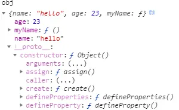
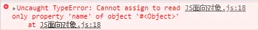

**前言**
======

JavaScript发明之始，从技术上来讲就是一门面向对象的语言，但在ES6之前，JS的很多特性和传统的面向对象语言有所不同，比如没有类的概念（ES6有了class）。今天结合《JS高编》第六章开始回顾和深入学习面向对象部分,包括对象、原型、原型链、继承等部分。

**一、理解对象**
------

谈JS的对象之前，先复习一下面向对象的基础概念和特点吧。
面向对象OOP（Object-oriented programming）,结合维基百科和百度百科的阐述，再谈谈我的理解。

**官方解释：**
面向对象就是基于对象概念，以对象为中心，以类和继承为构造机制，来认识、理解、刻画客观世界和设计、构建相应的软件系统

**我的理解：**
在JavaScript的世界中，万物皆对象。任何事和物你都可以将其定义为一个对象，程序员界有个笑话就是单身狗可以new一个对象嘛......我的粗浅理解，如果我是一个上帝，这个世界的任何人和事相对于我而言都是一个对象。有了控制对象的权力，我就可以对他们进行任何操作。针对事，我可以发布一个号令，发布一个政策，告诉别人怎么执行，什么时候开始，什么时候结束。针对人，我可以把他们分为男人、女人，这就是类。然后我可以限制他们的儿子是男人还是女人，是男人那就必须有和爸爸一样的性别特征，这就是继承。我还可以控制他们什么时间做什么事等等，整个过程我都是围绕某个对象来展开的，那么这个过程叫做面向对象。

**特点：**
1.类
2.继承
3.封装
4.多态
具体的在后面学习和复习时再谈。

**二、对象的属性类型**
-------------

```
let obj = {
    name:"勾鑫宇"，
    age:23
}
```

1.数据属性:`[[Configurable]],[[Enumerable]],[[Writable]],[[Value]]`
2.访问器属性：`[[Configurable]],[[Enumerable]],[[Get]],[[Set]]`

书上讲到属性类型时，只是简单提了一下是为了表示对象的特性，描述了属性的特征，并且在JS中不能直接访问。光看介绍不太理解到底是干什么的，但是看了数据属性的内容之后，发现不难理解。

我的理解，**数据属性就是我们可以从根源去控制一个对象的属性是否能被修改、删除、循环等，并可以通过访问器属性在别人不知道的情况下进行数据处理**。通过`Object.defineProperty()`这个方法，我们可以去设置这些限制对象属性操作的值，从而限制别人对某个对象属性的操作。举个例子，上面的`obj`这个对象的`name`属性的值是“勾鑫宇”，从现在起我不想任何人能够修改它的值，那么我就通过**数据属性**来将这个属性设置为不可修改，别人用`obj.name = "张三"`来修改就不会生效了。而我如果想在修改`name`属性的值后同时让`age`也跟着改变，那么此时就可以用**访问器属性**来进行数据处理。


我们是通过`Object.defineProperty()`这个方法来进行两种属性的设置。那么首先了解一下`Object.defineProperty()`这个方法，它接收三个参数：

    Object.defineProperty(对象名，属性名，描述符对象)
    //举例
    Object.defineProperty(obj,"name",{
        writable:false,//设置不可修改
        enumerable:false//设置不可循环到该属性
    })
可以在对象的constructor中找到该方法


同时，我们可以通过`Object.getOwnPropertyDescriptor()`方法来查看这四个特性的设置情况。接受两个参数：

```
Object.getOwnPropertyDescriptor(对象名，属性名)
```


**数据属性**
--------

数据属性包含一个数据值的位置。在这个位置可以读取和写入值，有4个描述其行为的特性。

下面就具体来对每个数据属性进行分析：
1.`[[Writable]]`:英文意思译为“可写的”，可理解为“可修改的”。这个属性用来设置对象的某个属性是否能被修改,默认为true。

```
//举例
let obj = {
    name:"勾鑫宇"，
    age:23
}

Object.defineProperty(obj,"name",{
    writable:false,//设置不可修改
})

//这时再进行修改就不会生效，严格模式下会报错
obj.name = "张三"
console.log(obj.name)//输出的还是勾鑫宇
```
严格模式报错



2.`[[Enumerable]]`:英文译为“可数的，可枚举的”，是否支持for-in循环来返回属性，默认为true。

```
//举例
let obj = {
    name:"勾鑫宇"，
    age:23，
    gender:male
}

Object.defineProperty(obj,"name",{
    enumerable:false,//设置不可通过for-in循环返回
})

//循环测试
for(let i in obj){
  console.log(i)//输出结果为age,gender,没有name属性，效果就像隐藏了这个属性。
}

//但这时我们的name属性还是存在的
console.log(obj)

```
3.`[[value]]`:这个就不说翻译了，大家都知道，就是值。这个特性是设置我们对象某个属性的值，读值、写值都在这里，默认值为undefined。

```
//举例
let obj = {
    name:"勾鑫宇"，
    age:23，
    gender:male
}

Object.defineProperty(obj,"name",{
    value:"张三",//设置name的值为张三
})

console.log(obj.name)//输出为张三

//设置value不影响后面再次修改值，value相当于修改了一次你最先定义的值而已。
obj.name = "傻逼"
concole.log(obj.name)//输出为“傻逼”
```
4.`[[Configurable]]`：英文译为“可配置的”，这个和前面的Writable有什么区别呢？放到最后讲是有原因的。前面有设置修改，设置循环，设置值，但是还没有设置是否可删除。Configurable就是做这个事情的。它表示能否通过delete删除属性从而重新定义属性，默认值为true。

```
//举例
let obj = {
    name:"勾鑫宇"，
    age:23，
    gender:male
}

Object.defineProperty(obj,"name",{
    configurable:false,//不允许删除属性
})

delete obj.name//报错"Uncaught TypeError: Cannot delete property 'name' of #<Object>"
```
这个属性还有最重要的一个特点，就是当你设置为false过后，就不能再设为true了，即使你设置了也无效。书上说得个时候你再设置value,enumerable都不会生效，只能设置writable，那么我们来试试。

```
//接着上面再把configurable修改为true
Object.defineProperty(obj,"name",{
    configurable:true,
})
//此时为会报错“Uncaught TypeError: Cannot redefine property: name”

//接着再次调用
Object.defineProperty(obj,"name",{
    value:'张三'
})

console.log(obj)//此时打印出来的是“张三”，而并书上所说的不能修改value的值。

//设置enumerable
Object.defineProperty(obj,"name",{
    enumerable:false//报错"Uncaught TypeError: Cannot redefine property: name"
})

```
测试了很多遍，value值在configurable为false的情况下仍然是可以修改的。
```
//设置writable
Object.defineProperty(obj,"name",{
    writable:false//不会报错
})

//再次修改writable
Object.defineProperty(obj,"name",{
    writable:true//报错“Uncaught TypeError: Cannot redefine property: name”
})

//修改value
Object.defineProperty(obj,"name",{
    value:"张三"//报错“Uncaught TypeError: Cannot redefine property: name”
})
```
上面设置**writable**说明在configurable和writable同时为false的情况下，就不能再修改任何值了。
Configurable还能控制是否能修改为访问器属性，这个在访问器属性的时候再讲。

**访问器属性**
---------
访问器属性不包含数据值，包含一对getter和setter函数，读取访问器属性时调用getter,写入时调用setter，并负责处理数据。
访问器属性同样有4个特性值可以设置：

1.`[[Configurable]]`:和数据属性的功能一样，只是有一点区别就是能否修改为数据属性。
2.`[[Enumerable]]`:和数据属性的功能一样。
3.`[[Get]]`:读取属性时调用，默认值为undefined。
get函数就是能够让你读取对象中的某个属性，前提是这个属性本身是只能通过对象方法来访问的，也就是说定义时要有下划线记号，否则本身就能直接访问的话，用get也没有意义了。

```
//举例
let obj = {
    _name:"勾鑫宇"，//下划线是一种记号，表示只能通过对象方法访问
    age:23，
    gender:male
}

console.log(obj.name)//输出为undefined

//用get方法来读取这个属性，并返回给对象
Object.defineProperty(obj,"name",{
    get(){
      return this._name
    }
})

console.log(obj.name)//输出“勾鑫宇”
```
4.`[[Set]]`:set函数就是写入属性的时候调用，默认值为undefined。
set函数会接收一个参数，这个参数就是我们修改对象或添加对象的属性值。
```
//举例
let obj = {
    _name:"勾鑫宇"，
    age:23，
    gender:male
}

//用set方法来写入这个属性
Object.defineProperty(obj,"name",{
    set(val){
      this._name = 'hh'+val
    }
})
obj.name = "张三"
console.log(obj.name)//输出为undefined
```
这个时候我们就没法进行下去了，因为无论怎样，都是输出`undefined`。原因就是因为我们没有使用get函数去读取我们写入的属性值，记住`name`在初始定义时就必须是`_name`。
```
//同时使用get和set
let obj = {
    _name:"勾鑫宇"，
    age:23，
    gender:male
}

//用set方法来写入这个属性
Object.defineProperty(obj,"name",{
    get(){
      return this._name
    },
    set(val){
      this. = 'hh'+val
    }
})
obj.name = "张三"
console.log(obj.name)//输出'hh张三'
```
从上面的代码就可以看出这个set和get函数的强大之处，那就是可以进行**数据处理**。我们可以通过set函数来进行对象里不同属性的关联，也可以实现属性值的各种计算。

```
//举例
let obj = {
    _name:"勾鑫宇"，
    age:23，
    gender:male
}

//用set方法来进行不同属性间的关联
Object.defineProperty(obj,"name",{
    get(){
      return this._name
    },
    set(val){
      if(val === '张三'){
        this._name = val;
        this.age = 18
      }
    }
})

//修改属性值
obj.name = '张三';
console.log(obj)//输出 {name:'张三',age:18,gender:male}
```
除了`Object.defineProperty()`方法，还有`Object.defineProperties()`方法，顾名思义，复数形式就是可以同时定义多个属性。它接受两个参数：

```
Object.defineProperties(obj,{
  name:{
    writable:false
  },
  age:{
    configurable:true
  }
  ...
})
```
这就是对属性类型的一个学习和理解，如有错误，请使劲点我。