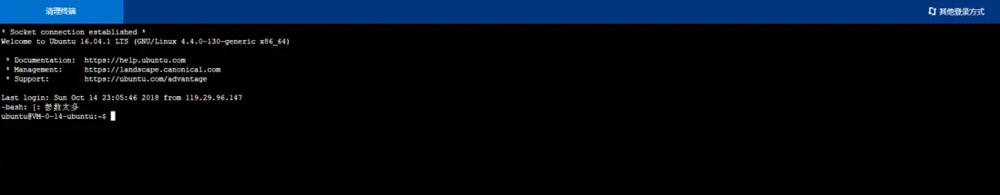
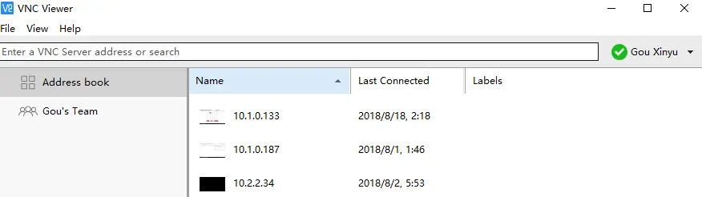
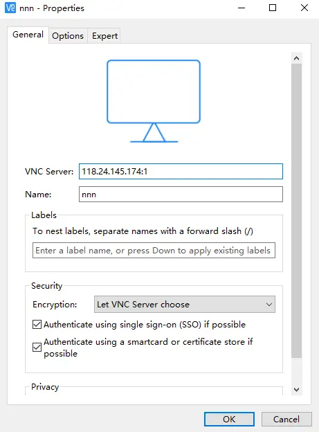
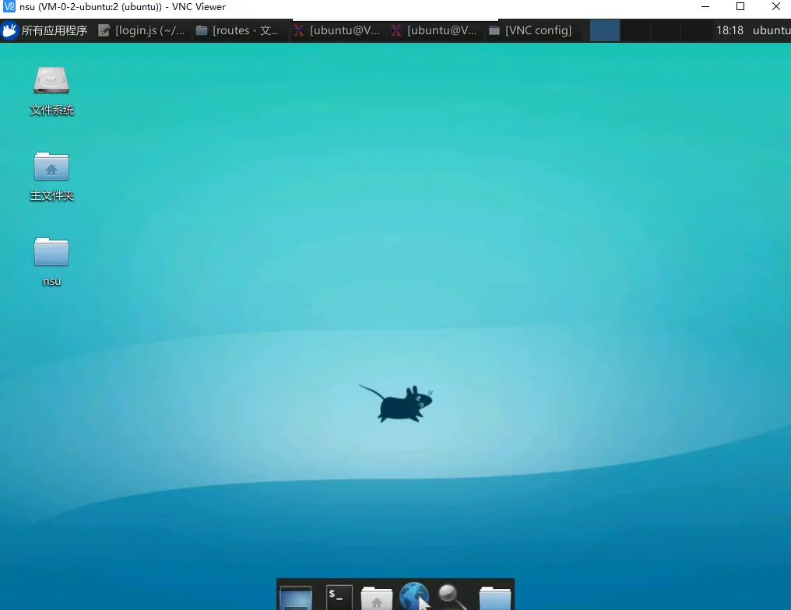
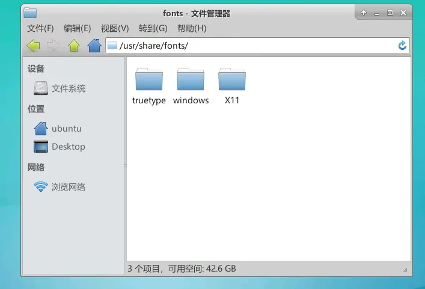
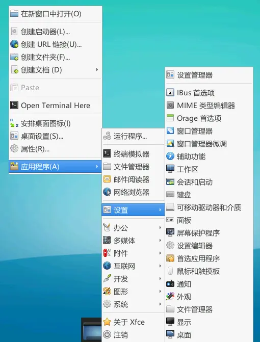
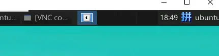
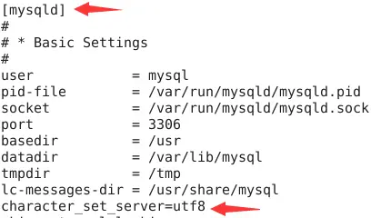
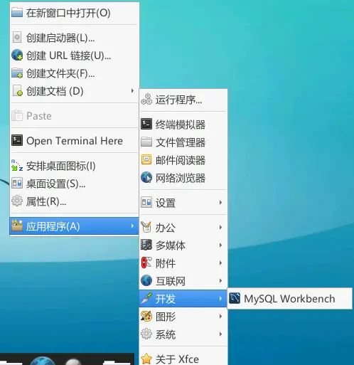

一、前言
==

可能一些初级前端和我一样，在有些项目需要前后台都一个人打通搞定的时候，对于后台和开发环境的部署还是比较头疼的。特别是Linux系统，由于没有系统接触过，也不太喜欢去记背那么多命令，大部分命令只能靠不断的google,baidu去完成。在最近的一个项目中，自己无数次重装系统，安装各种软件等，也有一点心得。稍稍总结出了一个能比较简洁快速地在Linux系统上搭建开发环境的流程，且能使用桌面可视化软件就不用命令操作...微软惯的病。如果嫌桌面太low或太慢会占用资源等，可以忽略安装可视化的步骤。

二、安装简介
====
目标系统：
服务器：腾讯云
系统：Ubuntu Server 16.04.1 LTS 64位
桌面可视化软件：xfce
远程连接软件：VNC Server
语言配置：Chinese
输入法：ibus
编辑器：gedit
浏览器：FireFox
数据库：MySQL
数据库可视化：workbench
后台语言：node.js
框架：express
文件传输软件:WinSCP

本机系统：Windows 10

三、安装流程
====

1.登录系统
-------



首先在腾讯云（阿里云等）端直接在网页中登录你的服务器，登录之后是一片黑色...对于刚接触Linux系统的人来说可能会手足无措。但是不要着急，我们一步一步来。

2.使Linux系统可视化
-------------
参考文章：https://blog.csdn.net/qq_35119422/article/details/79794092

这里需要首先了解一个命令，sudo。在Ubuntu系统中很多操作有权限限制，所以在操作之前加上sudo会使你获得管理员权限，这样很多操作就能进行了。
首先安装桌面可视化软件：xfce，执行以下代码：

```
//先更新软件包
sudo apt-get update

//安装xfce
sudo apt-get install xfce4
```
在安装过程中会出现一个是否安装的请求，这时输入y，然后回车就行了。如果想避免此请求，直接在每次安装命令后面加上 -y（注意有一个空格）。
安装完成后，我们的Linux系统就有了桌面。但是现在通过网页端并不能直接看到桌面系统，需要通过远程连接桌面。

3.远程连接桌面服务器
-----------
这里我使用的是VNC viwer远程连接软件，十分好用。
首先在Linux系统中安装VNC server服务，一步一步执行以下代码：


**1.安装VNC服务**

    sudo apt-get install vnc4server

**2.打开服务，并设置密码**

    vncserver :1 //这里的1可以是其他数字，只是在后面的连接时端口必须要保持一致

**3.这时要求输入一个8位数的密码，一定要记住，是后面远程连接时需要的（输入时看不见输入的内容，直接输完回车就行）**

    password://输入密码
**4.先关闭VNC服务，来修改启动文件**

    vncserver -kill :1
**5.修改文件**

    vi ~/.vnc/xstartup
   进入之后在最后一行回车新起一行，复制粘贴以下内容

```
sesion-manager & xfdesktop & xfce4-panel &   
xfce4-menu-plugin &   
xfsettingsd &   
xfconfd &   
xfwm4 &   

```
然后按Esc退出键，输入":wq"，回车即可保存当前修改的内容。

**6.启动VNC连接**

    vncserver :1
至此远程连接服务就安装完成了，我们只需要在Windows本机安装一个远程连接软件来来连接即可。

**7.到VNC Viewer官网下载软件**
https://www.realvnc.com/en/connect/download/viewer/
下载完成后打开是这个界面



然后左上角文件可以新建一个连接，如下图所示



填写需要连接的远程IP地址时要注意，后面要加上你刚刚在Linux系统上开的端口号，必须一致。

**8.成功连接**



连接成功后是这个界面，第一次进去会选择配置，选择默认即可。

4.配置中文和输入法
----------
参考文章：https://blog.csdn.net/betwater/article/details/53454873

系统默认是英文，并且中文有可能会出现乱码的情况，所以先把系统配置好中文。
**1.安装中文包**

    sudo apt-get install language-pack-zh-hans
**2.安装字体管理器**

    sudo apt-get install font-manager
3.拷贝需要的中文字体到系统上
在/usr/share/fonts目录中，新建一个windows文件夹，存放字体。


从windows传输文件到Linux可以使用**WinSCP**软件，自行百度下载使用。

**4.配置语言**
修改locale文件内容
    sudo vim /etc/default/locale 
将其修改为以下内容

    LANG="zh_CN.UTF-8"
    LANGUAGE="zh_CN:zh:en_US:en" 
保存退出，然后可以重启一次系统，系统就成功显示中文了。

**5.安装输入法**

    //安装ibus框架
    sudo apt-get install ibus ibus-clutter ibus-gtk ibus-gtk3 ibus-qt4
    //启动框架
    im-config -s ibus
    //安装拼音输入法
    sudo apt-get install ibus-pinyin

桌面右键，打开输入法ibus首选项设置（如果系统每次重启过后不能自动启动输入法，则需每次手动打开一次）



打开之后系统右上角便有了输入法，可设置切换输入法的方式，默认shif切换



5.安装浏览器和编辑器
-----------

    //安装firefox
    sudo apt-get install firefox
    //安装gedit
    sudo apt-get install gedit

6.安装Node.js和Express
-------------------
参考文章:
https://blog.csdn.net/well2049/article/details/79138045
https://blog.csdn.net/frozenshore/article/details/51589857

**1.安装node.js**

    //安装Node.js
    sudo apt-get install nodejs
    sudo apt install nodejs-legacy
    sudo apt install npm
    //安装淘宝镜像（解决国内使用npm安装太慢的问题）
    sudo npm config set registry https://registry.npm.taobao.org
    //安装更新工具
    sudo npm install n -g
    //更新node到最新版本
    sudo n stable
**2.安装Express**

    //全局安装
    sudo npm install -g express-generator
    //创建项目
    express -e myProject  
    cd myProject
    npm install
目录结构
bin——存放命令行程序
node_modules——存放所有的项目依赖库
public——存放静态文件，包括css、js、img等
routes——存放路由文件
views——存放页面文件（ejs模板）
app.js——程序启动文件
package.json——项目依赖配置及开发者信息


在myProject文件夹里打开终端，执行以下代码,开启服务

    sudo npm start
然后就可以在浏览器输入localhost:3000查看了
**注意：**在node_modules里执行"npm install mysql"来安装mysql模块，否则mysql用不了。

7.安装MySQL
---------
参考文章：https://www.linuxidc.com/Linux/2017-05/143861.htm

//安装核心服务和功能
sudo apt-get install mysql-server
//开启服务
service mysql start
//修改文件，解决中文乱码问题
sudo vi /etc/mysql/mysql.conf.d/mysqld.cnf 

在文件中的[mysqld]中添加character_set_server=utf8，然后保存退出


    //重启mysql服务
    service mysql restart
**安装可视化工具workbench**

    sudo apt-get install mysql-workbench
    
桌面右键开发中，可直接打开。



以上就基本搭建好开发环境了。

四、注意事项
======
1.在以上代码执行过程中，如果权限不够，前面加上sudo一般都能解决。
2.修改文件内容，如果想直接在桌面中的文件点开修改，需执行修改读写权限的命令
比如我要修改/usr/share/ 路径下的某个文件,执行以下命令赋予修改权限

    sudo chmod -R 777 /user/share/