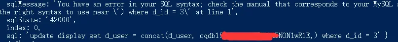

一、前言
==

第一次在社区发文章，作为一个大学未毕业的前端菜鸟，自己平常也经常逛各种技术社区，今天终于要发表自己的处女文章了，还是有点小激动的。由于最近在帮学校做开发一个基于微信小程序的投票系统项目，开发时也遇到很多坑，有一些心得，所以想分享给大家，一起讨论和进步。（个人开发技术有限，不好勿喷--）。

二、功能需求
==

 1. 程序能够发布各类主题活动进行投票。
 2. 各类主题活动下能够支持作品的展示及参与投票活动。
 3. 用户进入微信小程序后不需登录即可直接投票。
 4. 每天每个用户只能对同一个作品投一票，第二天方可继续投票。
 5. 显示投票时间的截止时间，通过倒计时展示。
 6. 每个作品自动生成一个二维码，扫描该二维码可进入该作品投票介绍界面。
 7. 其他：作品筛选、作品搜索、作品排名等。


三、开发环境及工具
-------
服务器环境：Ubuntu 16.04+Node.js+Express
数据库环境：普惠大众的MySQL
前端及测试：微信小程序开发工具
技术：Javascript+HTML+CSS+Node

四、效果展示
====

首页
--
![图片描述][1]


筛选
--
![图片描述][2]


搜索
--
![图片描述][3]


详情页
---
![图片描述][4]


  [1]: ../../assets/images/content-17/content-17-1.webp
  [2]: ../../assets/images/content-17/content-17-2.webp
  [3]: ../../assets/images/content-17/content-17-3.webp
  [4]: ../../assets/images/content-17/content-17-4.webp

排名这些界面就不展示了，由于还在测试阶段，界面还是比较学院派的，后期还会增加功能和修改界面。

五、实现过程及难点总结（代码）
=========

其实整个项目难点不多，大部分是数据的展示和一些简单的交互而已。而要做一个比较完善的投票系统，重头戏必然是投票这个功能是否能完美的实现并展现在用户的眼前。本项目中涉及到的难点就是如何使用户在不进行注册登录账号，甚至不用获取微信登录权限的情况下进行投票，同时系统能准确地记录下每个用户的投票行为，这里就要说说数据库的设计、小程序登录机制以及Node的应用了。

数据库设计
-----

由于要实现每个用户每天只能为同一个作品投一票的限制，大概想到的3钟方案：

 **1.** **每一个用户都有一个对应的投票表，每投一个作品就增加该作品的id，第二天删除该id，查询到不存在时即可再次投票。**
 **2. 同理也可以每个作品有一个对应的投票表，一个用户投一票，就增加该用户的id。**
 **3. 在作品表中添加一个投票用户字段，一个用户投一票则将该用户的id加进去，通过查询该id是否存在来识别是否已经投过票。**

前两种方案无形之中就会生成很多个表，并且其实这些表其实都是同一性质的。所以最终选择了第三种方案，作品表中添加一个字段，在该字段中添加每个投票用户的id（如果用户量很大的情况下应该会使用前面的或其他更好的方案）。但是一般字段所用的类型varchar最大长度只有255，当数据多一些的时候不能满足需要。而Mysql的text类型能够满足，最大的LONGTEXT能有4GB的存储，对于一个校园使用人数来说也是足够了（比如一个用户的openid有28个英文字符，也能存储千万级别的用户了。不过据说text类型的性能是不如varchar等类型的，至于影响有多大本人没有测试过）。但是同一个字段中增加字符，需要做一下处理，用符号将添加的数据分隔开来，方便后面的查询。

获取小程序用户id
---------
那么如何识别每个投票用户的身份呢？如果不授权获取微信用户的信息，那么可以直接获取微信用户的openid，这个openid是用户唯一的标识。**小程序官方的介绍是：小程序可以通过微信官方提供的登录能力方便地获取微信提供的用户身份标识，快速建立小程序内的用户体系。**

小程序的API中有个wx.login方法，通过提供小程序的Appid和AppSecret以及每次登录生成的一个不同的用户登录凭证，然后在服务器端通过微信官方接口获取到用户的openid等数据。具体官方文档和API等链接：https://developers.weixin.qq.com/miniprogram/dev/api/open-api/login/wx.login.html
**微信端请求：**

```
 wx.login({
      success: res => {
        console.log(res.code)
        wx.request({
          url: 'http://localhost:8080/data',
          data: {
            code: res.code,
            Appid: "wxXXX",
            AppSecret: "XXX",
          },
          header: {
            'content-type': 'application/json'
          },
          success: function (next) {
            console.log(next.data)
            that.setData({
              showlist: next.data
            })
          }
        })
      }
    });
```


**服务器端获取openid(Node)**

```
//定义微信小程序发送到服务器的参数
var code = req.query.code;
var appid = req.query.Appid;
var appsecret = req.query.AppSecret;
var index = req.query.id;
console.log(appid);
//请求外部url,传参返回用户ID等数据
request('https://api.weixin.qq.com/sns/jscode2session?appid='+appid+'&secret='+appsecret+'&js_code='+code+'&grant_type=authorization_code', function (error, response, data) {
    if (!error && res.statusCode == 200) {
        const connection = mysql.createConnection({
            //链接数据库的配置信息
            host: "localhost",
            user: "root",
            password: "XXX",
            port: 3306,
            database: "display",
            multipleStatements: true
        });
        // 打开链接
        connection.connect();
        //将data返回字符串形式转换成JSON格式.
        var id = JSON.parse(data)
        var newid = id.openid
     }
})
```

向数据库插入用户openid
--

接着就是往数据库中对应字段添加用户id就行了。但是这里有两个细节，也可以说是两个坑吧，由于自己菜，搞了半天才弄好...

1.如果该用户没有投过票，那么就向字段中添加该用户的openid，如果投过票说明字段中已经存在该用户id，返回提示信息。text类型是没有默认值的，所以初始没有投票用户时为Null。这里我在Node中直接用JS的indexOf函数是否包含该id字符串的方式来查询，于是就造成了一旦该字段为Null时查询就报错的情况。

**解决办法：在查询之前，先将该字段为Null的都转换为空字符串。刚开始想用JS判断该字段是否为空再进行操作，但是后来认为更好的解决方案是在查询之前直接用update将该字段的null值修改为空字符串，相比用JS判断清爽了许多。**

```
 connection.query( "update display set d_user='' where d_user is null ",[],
             function (queError,queData){
                ...
                ...
        })
```

2.插入用户id数据时，通过","将每个用户的openid分隔开，使用到concat函数拼接字符串。但是由于拼接的是前面获取的id变量和一个字符串","，所以写法比较坑。concat的第二个参数是字符串，用引号" "包裹，天真以为里面直接写变量，外面有括号，那出来不就直接是字符串了吗？但是却会报错，显示的并不是字符串。




解决办法：如果里面直接用ES6语法写\`${newid}`是不行的，得像下面这样写：

```
connection.query( "update display set d_user = concat(d_user, "+`'${newid},'`+") where d_id = "+index,[],
            function (err, data) {
                console.log(err)  //null
                console.log(data)  // object
            });
```


解决了这两个问题之后，其他就是同时增加票数等代码，不再赘述。

定时清除用户id
--------
这是能实现用户每天都能投票的关键，指定时间清除掉字段中的openid信息，就能达到第二天用户能够继续投票的功能。这里有多种方法实现，第一种是直接在数据库层操作，通过存储过程或者代码的方式将该字段的内容赋为空值即可。第二种是在Node里用定时器或者其他方法在指定时间将数据库该字段内容重新赋值。

我采用的是用JS定时器来解决，当每天00：00：00时，就重新赋值。但是要注意定时器的启动和清除，否则一直开启肯定会有性能影响。

```
var timer = setInterval(function(){
        var date = new Date();
        var hours=new Date().getHours();
        var minutes=new Date().getMinutes();
        var seconds=new Date().getSeconds();
        
        if(hours == 23 && minutes == 59 && seconds == 59){
        connection.query("update display set d_user = '' ",[],
        function (err, data) {
            console.log(data)
        })
    }
 },1000)
```

六、后期更新
====
后面有时间会更新活动倒计时的写法，每个页面生成二维码的方法等。
七、总结
==
由于数据库并不是很在行，不合理的地方肯定还有很多，希望得到大佬们的指点。同时，小程序前端还是有很多细节的地方遇到过坑，后面我会单独写文来分享。如果大家觉得还算有点看头的话，希望点个赞啥的，给菜鸟新人一点鼓励哈哈哈哈。


