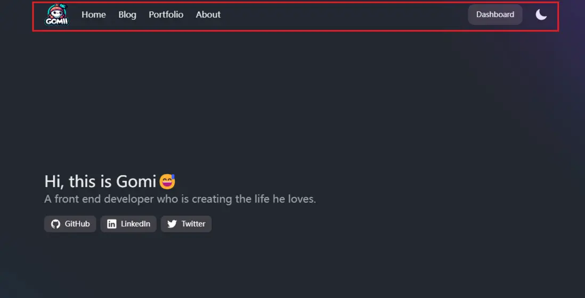
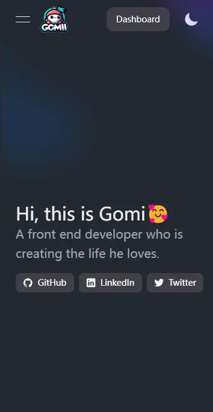
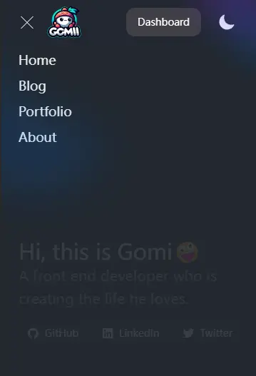

## Astro 简介
由于我之前的个人博客是Vue3+Quasar+Koa+MySql搭建的，整体就是SPA的思路，作为练手倒是可以锻炼前后端各方面的能力。但考虑到后期的迁移和更新等，实在过于麻烦，个人博客其实使用SSR或SSG之类的框架就行了，比如Nextjs，Nuxtjs，Remix等等。于是我接触到了Astro这个框架，它厉害的是不与任何前端框架进行强行绑定，比如Nextjs是与React强绑定的，Nuxtjs则是与Vue强绑定的。而Astro则可以使用任何流行的前端框架，甚至可以混用，并且同时支持SSR和SSG。

另一点是Astro对markdown的支持也相对不错，作为博客放文章也是挺不错的。

其次是Astro的官方文档写得很详尽，中文文档也比较友好，油管上的教程也挺多的。

-> [Astro官网](https://astro.build/)

## 配置
为了美观和效率，我选择了NextUI和React来作为快速构建博客的依赖。NextUI是基于tailwindCSS的，所以对于样式构建更加方便和快速。

-> [NextUI官网](https://nextui.org/)

接下来的步骤非常简单，我们只需要安装好依赖就行了。Astro有个配置文件`Astro.config.mjs`

```
import { defineConfig } from 'astro/config';
import react from "@astrojs/react";
import node from '@astrojs/node';
import tailwind from "@astrojs/tailwind";
import remarkToc from 'remark-toc';
import { remarkReadingTime } from './plugins/remark-reading-time.mjs';


// https://astro.build/config
export default defineConfig({
  output: 'server',
  prefetch: true,
  integrations: [react(), tailwind()],
  adapter: node({
    mode: "standalone"
  }),
  experimental: {
    contentCollectionCache: true,
  },
  server: {
      port: 3000,
      host: true,
      serverEntry: 'entry.mjs'
  },
  devToolbar: {
    enabled: false
  },
  markdown: {
    // 示例：在 Markdown 中使用 prism 进行语法高亮显示
    syntaxHighlight: 'prism',
    remarkPlugins: [remarkToc, remarkReadingTime],
    gfm: true,
  }
});
```

tailwind同样有个配置文件`tailwind.config.mjs`

```
/** @type {import('tailwindcss').Config} */

import { nextui } from "@nextui-org/react";
import typography from '@tailwindcss/typography';
import remark from 'remark';

export default {
	content: ['./src/**/*.{astro,html,js,jsx,md,mdx,svelte,ts,tsx,vue}', "./node_modules/@nextui-org/theme/dist/**/*.{js,ts,jsx,tsx}"],
	darkMode: "class",
	theme: {
		extend: {},
		screens: {
			'xs': '370px',
			'sm': '640px',
			'md': '768px',
			'lg': '1024px',
			'xl': '1280px',
			'2xl': '1536px',
		},
	},
	plugins: [nextui({
		themes: {
			light: {
				colors: {
					background: "#e6e9e9", // or DEFAULT
					foreground: "#000000", // or 50 to 900 DEFAULT
					primary: {
						//... 50 to 900
						foreground: "#7828C8",
						DEFAULT: "#7828C8",
					},
				},
				//... rest of the colors
			},
			dark: {
				colors: {
					background: "#22272e", // or DEFAULT
					foreground: "#ECEDEE", // or 50 to 900 DEFAULT
					primary: {
						//... 50 to 900
						foreground: "#7828C8",
						DEFAULT: "#7828C8",
					},
				},
				// ... rest of the colors
			}
		}
	}),
	typography(({ theme }) => ({
        dark: {
          css: {
            '--tw-prose-body': theme('colors.pink[800]'),
            '--tw-prose-headings': theme('colors.pink[900]'),
            '--tw-prose-lead': theme('colors.pink[700]'),
            '--tw-prose-links': theme('colors.pink[900]'),
            '--tw-prose-bold': theme('colors.pink[900]'),
            '--tw-prose-counters': theme('colors.pink[600]'),
            '--tw-prose-bullets': theme('colors.pink[400]'),
            '--tw-prose-hr': theme('colors.pink[300]'),
            '--tw-prose-quotes': theme('colors.pink[900]'),
            '--tw-prose-quote-borders': theme('colors.pink[300]'),
            '--tw-prose-captions': theme('colors.pink[700]'),
            '--tw-prose-code': theme('colors.pink[900]'),
            '--tw-prose-pre-code': theme('colors.pink[100]'),
            '--tw-prose-pre-bg': theme('colors.pink[900]'),
            '--tw-prose-th-borders': theme('colors.pink[300]'),
            '--tw-prose-td-borders': theme('colors.pink[200]'),
            '--tw-prose-invert-body': theme('colors.pink[200]'),
            '--tw-prose-invert-headings': theme('colors.white'),
            '--tw-prose-invert-lead': theme('colors.pink[300]'),
            '--tw-prose-invert-links': theme('colors.white'),
            '--tw-prose-invert-bold': theme('colors.white'),
            '--tw-prose-invert-counters': theme('colors.pink[400]'),
            '--tw-prose-invert-bullets': theme('colors.pink[600]'),
            '--tw-prose-invert-hr': theme('colors.pink[700]'),
            '--tw-prose-invert-quotes': theme('colors.pink[100]'),
            '--tw-prose-invert-quote-borders': theme('colors.pink[700]'),
            '--tw-prose-invert-captions': theme('colors.pink[400]'),
            '--tw-prose-invert-code': theme('colors.white'),
            '--tw-prose-invert-pre-code': theme('colors.pink[300]'),
            '--tw-prose-invert-pre-bg': 'rgb(0 0 0 / 50%)',
            '--tw-prose-invert-th-borders': theme('colors.pink[600]'),
            '--tw-prose-invert-td-borders': theme('colors.pink[700]'),
          },
        },
      }))
	],
}
```

以上的文件配置内容照着Astro和NextUI官方文档都能完成。

## 组件
接下来我们写一个导航组件，如下图所示：



我们直接使用NextUI的Navbar组件，此时我们写的是一个`Header.tsx`文件，也就是react组件。

```
import { NextUIProvider, Navbar, Link, Button, NavbarBrand, NavbarContent, NavbarItem } from "@nextui-org/react";
import { getRouter } from '../../config';


/**
 * Navbar component
 * @returns 
 */
export default function Header(props) {
    return (<NextUIProvider>
        <Navbar className="nav-bar" maxWidth="lg">
            {
                props.nav
            }
            {/* <NavbarMenuToggle
                className="sm:hidden"
            /> */}
            <NavbarBrand className="sm:hidden">
                {
                    props.logo
                }
            </NavbarBrand>

            <NavbarContent className="hidden sm:flex gap-6" justify="center">
                <NavbarBrand>
                    {
                        props.logo
                    }
                </NavbarBrand>

                {
                    Object.values(getRouter()).map((v, i) => <NavbarItem key={i}><Link color="foreground" href={`/${v.path}`}>
                        {v.name}
                    </Link></NavbarItem>)
                }
            </NavbarContent>

            <NavbarContent className="sm:flex gap-4" justify="end">
                <NavbarItem>
                    <Button>Dashboard</Button>
                </NavbarItem>
                <NavbarItem className="lg:flex">
                    {
                        props.theme
                    }
                </NavbarItem>
            </NavbarContent>
        </Navbar>

    </NextUIProvider>)
}
```

这个组件的渲染方式在Astro中默认是静态渲染的，也就是说，组件内部的任何交互方法都是不生效的，比如onClick等事件。此时需要在Astro组件中引用该react组件的地方，给组件加上`client:load/visible/only`指令，告诉Astro这个React组件是否需要在客户端渲染。

由于测试效果发现，客户端渲染的组件在渲染速度上会变慢，所以我们选择不使用客户端渲染，导航中只有切换主题的按钮和手机端的导航按钮需要交互事件。那么我们就将这两个按钮的位置设置为props传进来，这两个组件我们就直接使用Astro组件为其添加鼠标交互事件，而不写成react组件, 保证其渲染速度最快化。同样的，由于Astro本身自带的Image组件对图片有优化效果，所以我们把logo的位置也通过props传进来。





最后在我们的Astro组件中，引入Header.tsx组件，然后将有交互事件的组件，都通过props传进去即可。

```
<Header>
		<Nav slot="nav" />
		<ThemeBtn slot="theme" />
		<Image src={logo} alt="logo" slot="logo" class="w-12" />
</Header>
```

而交互事件则使用比较原始的方式，通过事件监听`addEventListener`来完成，这也是Astro官方推荐的方式。

```
---
import { getRouter } from "../../config";
---

<style>
    @keyframes menuAnimationStart {
        0% {
            height: 0px;
        }

        20% {
            height: 100px;
        }

        40% {
            height: 200px;
        }

        60% {
            height: 400px;
        }

        80% {
            height: 600px;
        }

        100% {
            height: calc(100vh - var(--navbar-height) - 1px);
        }
    }

    @keyframes menuAnimationStop {
        0% {
            height: calc(100vh - var(--navbar-height) - 1px);
        }

        20% {
            height: 600px;
        }

        40% {
            height: 400px;
        }

        60% {
            height: 200px;
        }

        80% {
            height: 100px;
        }

        100% {
            height: 0px;
        }
    }

    .menu-open {
        animation: menuAnimationStart 0.5s linear backwards;
    }

    .menu-close {
        animation: menuAnimationStop 0.5s linear backwards;
    }
</style>

<script>
    let isOpen = false;
    const clickEvent = () => {
        isOpen = false;
        const btn = document.querySelector("#sm-nav-btn");
        const menu = document.querySelector("#sm-nav-menu");
        btn.addEventListener("click", () => {
            isOpen = !isOpen;
            btn.setAttribute("data-open", String(isOpen));

            if (isOpen) {
                menu.classList.replace("hidden", "flex");
                menu.classList.remove("menu-close");
                menu.classList.add("menu-open");
                menu.style.height = "calc(100vh - var(--navbar-height) - 1px)";
            } else {
                menu.classList.replace("menu-open", "menu-close");
                menu.style.height = "0px";
                setTimeout(() => menu.classList.replace("flex", "hidden"), 400);
            }
        });
    };
    clickEvent();

    window.addEventListener("resize", () => {
        isOpen = false;
        const btn = document.querySelector("#sm-nav-btn");
        const menu = document.querySelector("#sm-nav-menu");
        btn.setAttribute("data-open", String(isOpen));
        menu.classList.replace("menu-open", "menu-close");
        menu.style.height = "0px";
        setTimeout(() => menu.classList.replace("flex", "hidden"), 400);
    });
    document.addEventListener("astro:after-swap", clickEvent);
</script>

<button
    id="sm-nav-btn"
    class="group flex items-center justify-center w-6 h-full rounded-small tap-highlight-transparent outline-none data-[focus-visible=true]:z-10 data-[focus-visible=true]:outline-2 data-[focus-visible=true]:outline-focus data-[focus-visible=true]:outline-offset-2 sm:hidden"
    type="button"
    aria-pressed="false"
    ><span class="sr-only">open navigation menu</span><span
        class="w-full h-full pointer-events-none flex flex-col items-center justify-center text-inherit group-data-[pressed=true]:opacity-70 transition-opacity before:content-[''] before:block before:h-px before:w-6 before:bg-current before:transition-transform before:duration-150 before:-translate-y-1 before:rotate-0 group-data-[open=true]:before:translate-y-px group-data-[open=true]:before:rotate-45 after:content-[''] after:block after:h-px after:w-6 after:bg-current after:transition-transform after:duration-150 after:translate-y-1 after:rotate-0 group-data-[open=true]:after:translate-y-0 group-data-[open=true]:after:-rotate-45"
    ></span></button
>

<ul
    id="sm-nav-menu"
    class="sm:hidden hidden z-30 px-6 pt-2 fixed max-w-full top-[var(--navbar-height)] inset-x-0 bottom-0 w-screen flex-col gap-2 overflow-y-auto backdrop-blur-xl backdrop-saturate-150 bg-background/90"
    style="--navbar-height: 4rem;"
>
    {
        Object.values(getRouter()).map((v) => (
            <li
                class="text-large data-[active=true]:font-semibold"
                data-open="true"
            >
                <a
                    color="foreground"
                    class="relative inline-flex items-center tap-highlight-transparent outline-none data-[focus-visible=true]:z-10 data-[focus-visible=true]:outline-2 data-[focus-visible=true]:outline-focus data-[focus-visible=true]:outline-offset-2 text-large text-foreground no-underline hover:opacity-80 active:opacity-disabled transition-opacity w-full"
                    tabindex="0"
                    role="link"
                    href={`/${v.path}`}
                >
                    {v.name}
                </a>
            </li>
        ))
    }
</ul>

```

需要注意的是，我使用了视图过渡的效果，在Astro中，提供了基于浏览器原生效果的View Transition API。Astro在路由切换到新的页面后，我们的事件效果会被移除掉，此时需要在Astro提供的钩子函数`astro:after-swap`中，来添加交互事件。个人感觉这是相对麻烦的地方。


