## 一、前言
首先介绍下[Video Roll](https://gomi.site/VideoRoll)，这款浏览器插件能够帮助你旋转、缩放、调整比例和镜像翻转任意网页中的HTML5视频。目前已经有超过**1000+**用户在使用，完全开源，零差评。
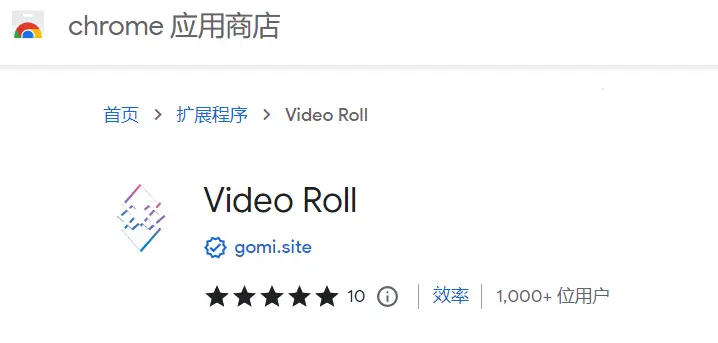

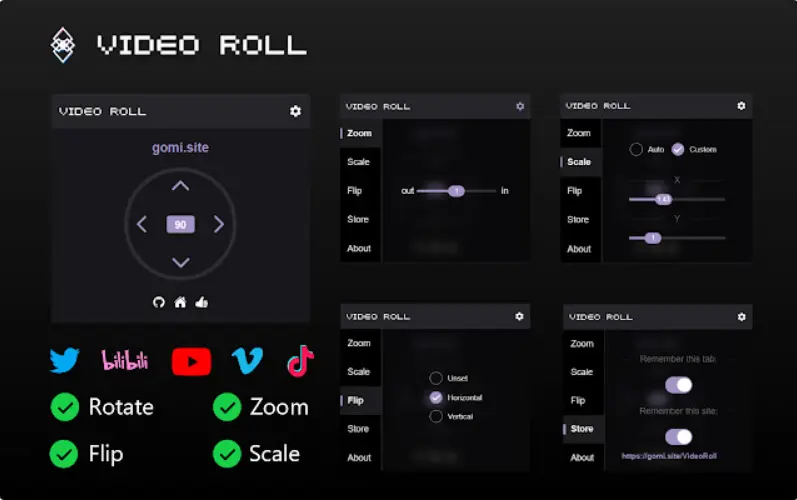

那么我们来介绍下这款小众插件究竟是做什么的。

## 二、Video Roll解决的问题
首先我整理了一下PC平台的网络视频存在哪些问题:

#### **1.视频方向不对**
大部分视频网站默认的比例是**16：9**的视频，按理说是横屏播放的，也就是宽占16，高只占9。但是我们有时会看到下面这种视频：

这样的视频很明显应该是个竖屏视频，宽高比例正好相反，但是由于作者在上传视频时没有调整方向，所以就出现了上面这种现象。于是乎弹幕就有很多人说脖子都歪疼了😂。当然也可能存在镜像翻转的问题，但镜像一般不太影响观看体验。横竖相反的情况是最影响观看体验的。

#### **2.视频拉伸** 
除了方向问题，某些视频还存在比例失衡的问题。也就是所谓的被过度拉伸，导致看上去视频内容变形。
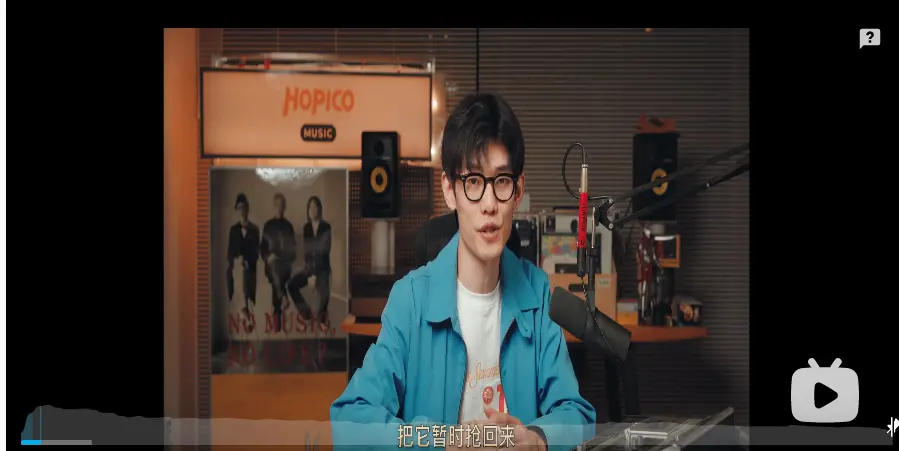

#### **3.视频黑边**
视频黑边通常是视频内容没完全占满容器导致的，这种是否影响观看体验取决于视频的内容以及黑边大小。有些视频内容区域太小，黑边太大。
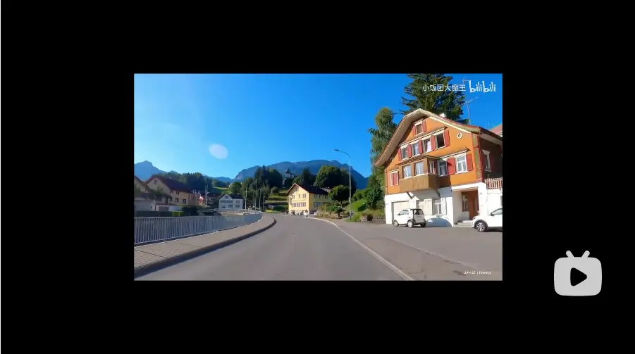

## 三、Video Roll的解决方案
由于现代浏览器的视频基本都是基于HTML5的`<video>`标签来实现的，你所能见到的各大视频网站，例如Youtube、Bilibili、Viemo、Tiktok等等，无一例外。那么我们就直接从Video标签上下手。

相信做过前端的同学应该都会想到，直接使用CSS的`transform`属性就能解决这些问题。没错，Video Roll就是直接通过`transform`搞定的。Video Roll通过`transform`中3d和2d两种变形效果同时存在的方式，同时加上一些简单的算法，实现了完美的解决方案。

#### **1.方向问题**
方向直接通过`transform: rotate`就能搞定，在使用层面，用户只需要点一下即可。
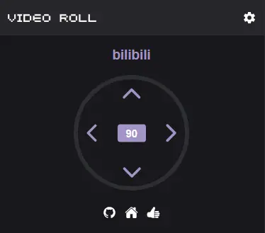

虽然原理简单，但是存在一个问题，就是旋转后视频的大小还是没有发生变化，由于视频外有一层容器，那么视频肯定就会被遮挡而无法显示完全，就像下面的效果。
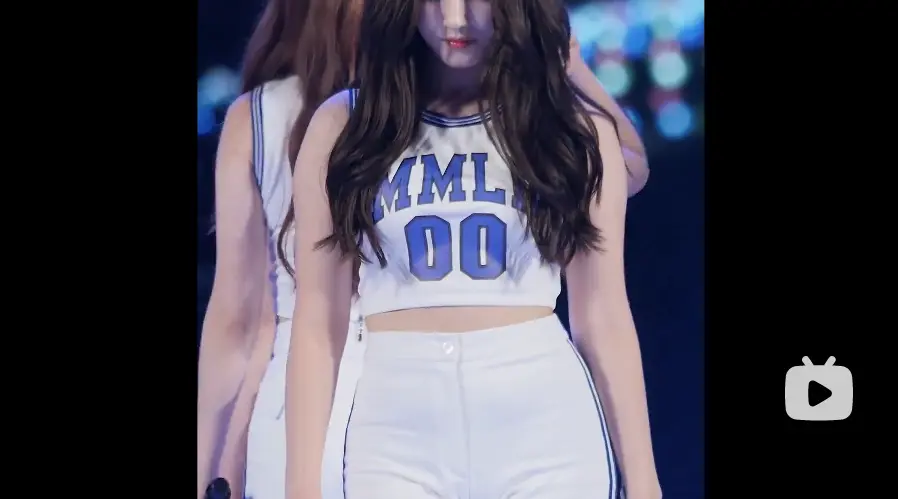

所以我们还需要使用`scale`属性来进行一定的缩放，而这个缩放的数值就需要通过视频大小和容器大小来进行一定的计算而得到。通过`videoWidth`和`videoHeight`以及`offsetWidth`和`offsetHeight`来进行宽高比例缩放的计算。经过计算后，最终的效果如下：
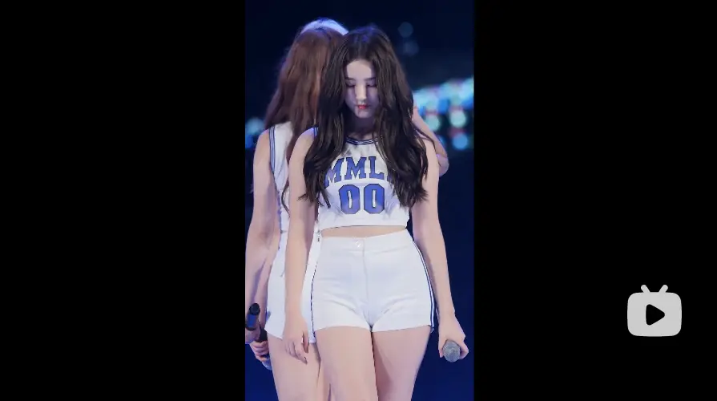

由于旋转缩放后，`rotate`和`scale`属性已经被占用，这时如果我们还需要镜像翻转怎么办呢？也只需要点一下即可。
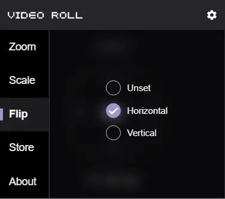

实现层面则是再加上`rotate3d`或`scale3d`即可，这样他们将同时生效。

#### **2.拉伸问题**
由于拉伸问题程序无法自动判断，所以将交给用户自己设置，即通过`scaleX`和`scaleY`来解决，用户只需要拖拽即可。
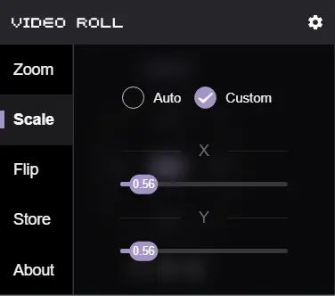

### **3.黑边问题**
黑边问题本质上是视频的大小不对，同样通过`scale`即可解决。
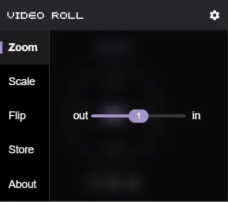

### **4.重复配置问题**
最后Video Roll还考虑到了如果用户第二次再打开相同的视频，难道又要重复设置一次吗？当然不需要，我们只需要保留对该视频的配置即可，当我下次打开相同的视频时，便会自动生效。
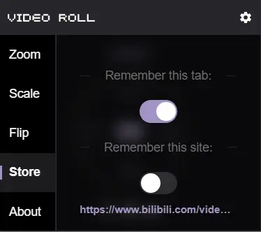

## 四、总结
其实Chrome商城有一些类似的插件，这里推荐两个能用的：
* **Video Rotater**
* **Video Transformer**

Video Rotater比Video Roll早发布，我也是在用了它之后，发现存在一些问题，决定自己写一个。
Video Transformer则是比Video Roll晚发布，没有交互界面，以快捷键操作为主，相对麻烦。

Video Roll诞生的初衷只是为了方便我自己看某些视频时的体验，但笔者想到一定会有很多人有相同的问题，于是选择了发布为浏览器插件，并且开源了出来。

## 五、欢迎加入

由于发布后用户量一直在增加，现在周活用户已经超过了**1K**，Video Roll可能会持续保持更新，提供更多优化视频体验的功能，希望能做成一个**All in one**的插件，当你在PC端看视频时，只需要这样一个插件即可满足大部分需求。也希望有兴趣的朋友可以和我一起来完善这个插件。

目前插件是基于`Typescript`、`Parcel`和`Vue3`构建的，UI库是`Vant`。下一步希望优化插件构建的工具链、提供第三方库和脚本、以及重构官网。

Github: https://github.com/VideoRoll/VideoRoll
官网：https://gomi.site/VideoRoll
Chrome商城：https://chrome.google.com/webstore/detail/video-roll/cokngoholafkeghnhhdlmiadlojpindm
