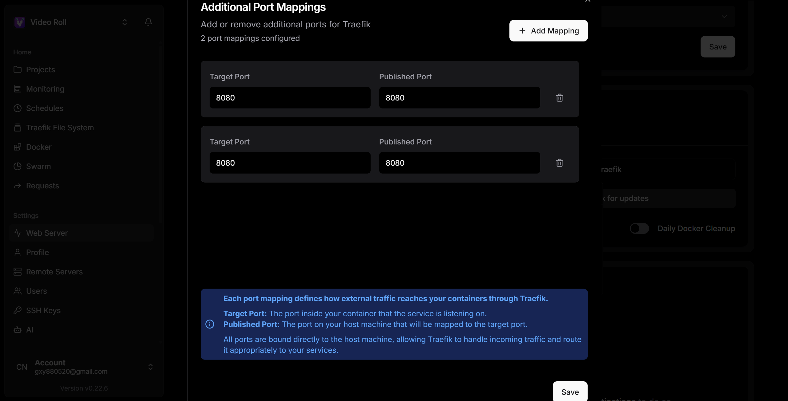
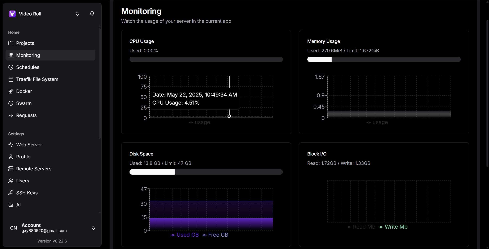
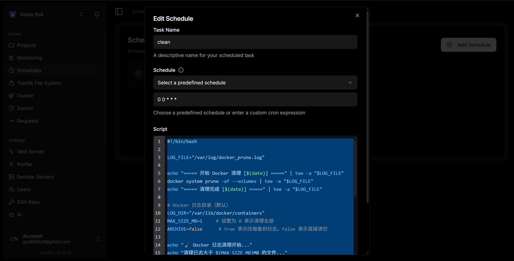

## 简介

[Dokploy](https://dokploy.com/)是一个开源的一站式部署平台，是Vercel和Netlify的替代品。因为我很多网站都是部署在Netlify上的，所以对这种在github提交后就能自动部署的平台非常青睐，因为能省非常多的事，又能实现很多自动化的功能。


## 部署重点

### Web应用端口冲突
部署的步骤非常简单，按照官方文档来就能完成。这里主要说一下注意的地方，第一个是dokploy管理端默认的端口是3000，所以如果你的网站是基于node的，比如nextjs、Astro等框架，默认端口都是3000，这会导致端口冲突。于是我修改了我自己项目的端口，选择不改动dokploy的端口。

### 端口配置
比如我项目的端口改为了3001，但是由于服务器对外暴露的端口是8080，以前我是通过nginx来代理转发。现在需要使用dokploy的Traefik来作为代理，由于默认也是8080端口，所以再Port Mappings中将端口都设置为8080即可。这样就会自当转发到我们部署的3001端口。详细可以查看advanced中的traefik配置是否正确


### HTTPS
通过dokploy选择let's encrypt后，我们不再需要自己去生成或者购买https证书。

### 环境变量
其次是`.env.local`相关的高敏感配置文件，比如strip、supbase等的token信息，一般都是不会提交到仓库的，所以即使自动部署到平台上，你的项目也不会有你项目需要的配置信息。这时候就要用到dokploy提供的环境变量功能，它的作用和你项目中的`.env.local`是类似的。

### 部署错误
还有就是由于是docker部署，在你的项目是**monorepo**的情况下，比如pnpm的workspace，可能会出现错误。你需要在项目种添加`.dockerignore`文件来忽略调一些文件，比如**node_modules**。

### 磁盘监控
最后就是磁盘占用，由于dokploy每次部署都会产生日志信息，还会有很多的docker本身的冗余镜像等等，所以我的云服务器50G的大小，再部署了接近10此后，就快占满了。

这时候只有手动清除日志、镜像等占内存的文件。这时候dokploy提供的schedules就起作用了，你可以写一段清除日志和镜像的shell脚本，让它每天定时执行，就可以保证你的磁盘不会被占满了，下面是我让AI帮我写的脚本。

```shell
#!/bin/bash

LOG_FILE="/var/log/docker_prune.log"

echo "===== 开始 Docker 清理 [$(date)] =====" | tee -a "$LOG_FILE"
docker system prune -af --volumes | tee -a "$LOG_FILE"
echo "===== 清理完成 [$(date)] =====" | tee -a "$LOG_FILE"

# Docker 日志目录（默认）
LOG_DIR="/var/lib/docker/containers"
MAX_SIZE_MB=1     # 设置为 0 表示清理全部
ARCHIVE=false      # true 表示压缩备份日志，false 表示直接清空

echo "🧹 Docker 日志清理开始..."
echo "清理日志大于 ${MAX_SIZE_MB}MB 的文件..."

# 遍历并清理日志
find "$LOG_DIR" -type f -name "*-json.log" | while read -r log_file; do
    size_bytes=$(stat -c %s "$log_file")
    size_mb=$((size_bytes / 1024 / 1024))

    if [ "$MAX_SIZE_MB" -eq 0 ] || [ "$size_mb" -ge "$MAX_SIZE_MB" ]; then
        echo "🗑️ 清理: $log_file (${size_mb}MB)"
        if [ "$ARCHIVE" = true ]; then
            gzip "$log_file"
        else
            cat /dev/null > "$log_file"
        fi
    else
        echo "✅ 保留: $log_file (${size_mb}MB)"
    fi
done

echo "✅ Docker 日志清理完成"

```


