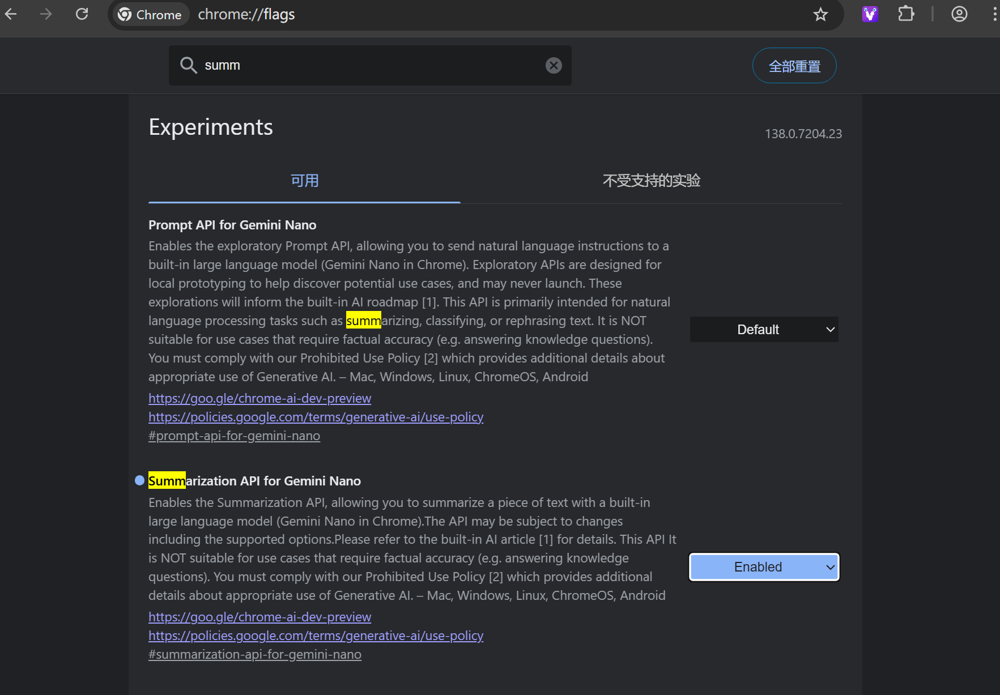

## 前言

之前一直想把视频AI总结的功能集成到Video Roll中，但是由于调用各厂商的AI接口基本上无法实现完全免费，即使免费额度也是有限制的，所以想免费提供给用户使用就捉襟见肘。另一种方式就是让用户自己填各个厂商的key来做一个中间件而已。于是觉得没太大必要，一直搁置了这个功能。但是最近Chrome宣布138版本将正式内置AI接口，比如Summarizer, Translater等。于是我赶紧下载Chrome 138 beta版本来进行测试，经测试效果还是非常不错，它的模型是基于Gemini Nano，于是我将其立马集成到了新版的Video Roll中，待Chrome 138正式发布，即可上线。
> 注意：Chrome 138 beta第一次需要在chrome://flags来启用Summarizer API



## 检测API和下载

按照官方文档的方式进行调用即可，这个过程中会有两个比较重要的步骤，第一是检测Summarizer API是否可用，如果可用，第一次可能需要下载模型，下载完成后才能调用后续的API。

关于API是否可用，官方给了基本配置，但目前经我的测试，实际使用很多不确定因素。比如头天开启后可以正常使用，第二天重启电脑后就提示无法使用了，也不知道是电量不足还是其他原因。

- Operating system: Windows 10 or 11; macOS 13+ (Ventura and onwards); or Linux. Chrome for Android, iOS, and ChromeOS are not yet supported by our APIs backed by Gemini Nano.
- Storage: At least 22 GB on the volume that contains your Chrome profile.
- GPU: Strictly more than 4 GB of VRAM.
- Network: Unlimited data or an unmetered connection.

```ts
public async downloadModel(): Promise<void> {
    return new Promise(async (resolve, reject) => {
      if (this.isInitialized) {
        resolve();
      }

      try {
        if (!("Summarizer" in self)) {
          console.log("Summarizer API 不可用");
          reject(new Error("Summarizer API not loaded"));
        }

        const availability = await window.Summarizer.availability();

        console.log("--availability", availability);
        if (availability === "unavailable") {
          console.log("Summarizer API 不可用");
          reject(new Error("Summarizer API unavailable"));
          return;
        }

        const options: SummaryOptions = {
          sharedContext: "This is a YouTube video transcript summary.",
          type: "key-points",
          format: "markdown",
          length: "long",
        };

        if (availability === "available") {
          // The Summarizer API can be used immediately .
          this.summarizer = await window.Summarizer.create(options);
        } else {
          // The Summarizer API can be used after the model is downloaded.
          this.summarizer = await window.Summarizer.create(options);
          this.summarizer.addEventListener("downloadprogress", (e) => {
            console.log(`Downloaded ${e.loaded * 100}%`);
            const progress = e.total
              ? (e.loaded / e.total) * 100
              : e.loaded * 100;
            console.log(`Summarizer 模型下载进度: ${progress.toFixed(2)}%`);
          });
          await this.summarizer.ready;
        }

        this.isInitialized = true;
        console.log("Summarizer 服务初始化成功");
        resolve();
      } catch (error) {
        console.log("Summarizer 服务初始化失败:", error);
        this.isInitialized = false;
        reject(
          error instanceof Error
            ? error
            : new Error("Failed to initialize summarizer")
        );
      }
    });
  }
```

## 调用总结

总结可以使用流式和批量两种方式，为了更好的用户体验，一般使用流式输出
```ts
/**
   * Generate summary from text
   * @param {string} text - The text to summarize
   * @param {SummaryOptions} [options] - Summary options
   * @returns {Promise<string | null>} The generated summary or null if generation fails
   */
  public async generateSummary(
    text: string,
    tabId: number,
    options: Partial<SummaryOptions> = {}
  ): Promise<string | null> {
    if (!text?.trim()) {
      logDebug("文本为空，无法生成摘要");
      return null;
    }

    try {
      if (!this.isInitialized || !this.summarizer) {
        await this.initialize();
      }

      if (!this.summarizer) {
        throw new Error("Summarizer not initialized");
      }

      const summaryOptions: SummaryOptions = {
        context:
          options.context || "This is a YouTube video transcript section.",
        length: options.length || "long",
        format: "markdown",
        type: options.type || "key-points",
      };

      const result = await this.summarizer.summarizeStreaming(text, {
        context:
          "这是一个带时间线的Youtube视频字幕摘要, 请用中文生成摘要，并在摘要标注时间段",
      });

      // 创建解码器
      const decoder = new TextDecoder();
      let summary = "";

      // 处理流式响应
      const reader = result.getReader();
      while (true) {
        const { done, value } = await reader.read();
        if (done) break;

        summary += value;

        // 触发进度更新事件
        sendRuntimeMessage(tabId, {
          type: ActionType.SUMMARIZING,
          tabId,
          payload: {
            text: summary,
            complete: false,
          },
        });
      }

      // 触发进度更新事件
      sendRuntimeMessage(tabId, {
        type: ActionType.SUMMARIZE_DONE,
        tabId,
        payload: {
          text: summary,
          complete: true,
        },
      });
      return summary;
    } catch (error) {
      logDebug("生成摘要失败:", error);
      return null;
    }
  }
```

## 限制
目前测试了输入大概超过20000个字符串就会提示too large，模型无法输出的情况。这也可能是由于客户端性能和模型的限制。

## 总结
总的来说客户端内置AI是一个巨大的进步，这让前端工程师可以直接在客户端使用AI，也能通过完成一些简单的任务。


