## 一、前言
我先抛出一个问题，市面上这么多相关的技术和方案，如果让你来设计一套Web系统，你会怎么选择？

大家都知道，一个完整的**高可用、高性能**的Web系统本身的构成是比较复杂的，除了我们熟知的前端部分，比如**静态网页生成器、JS库、UI框架、监控工具**等，还有**Web Server、云服务、CDN内容分发、代理服务、HTTP缓存与加速**等等。

有人会说，我会按照我最熟悉的方案来设计，这样风险最小。
有人会说，我会先Google一些成熟的方案，然后分别预研一下，使用效果最好的方案。
有人会说，我会直接找技术大牛，他做的一定没问题。

其实只要结果是好的，最终落地成功，效果甚好，那么技术方案怎么选都没有错。

但是如果我告诉你，现在市面上各大网站的技术栈我都知道个百分之六七十，前端框架用的什么，服务器用的什么，后端用的什么，CDN用的什么等等，你会先听听我的建议么？我相信你会的。

[**Wappalzer**](https://www.wappalyzer.com/)就是这样一款强大的浏览器插件，它的用户超过100万，并且它的使用超级简单，只需要点一下，就能看到当前你访问的网站所使用的技术栈。先让我们看看**Segmentfault**用了哪些技术吧。

## 二、发现你不知道的技术
那么第二个问题来了，如果你是个有经验的架构师，那么Wappalzer对你的帮助可能不大。但是如果你只是一个前端工程师或者后端工程师，现在你要担负起全栈的工作，负责自己不太熟悉的那部分内容，并且要给出技术方案，可能是个头疼的问题。因为对于前端工程师来说，服务器用什么？后端语言用什么？数据库用什么？搜索引擎用什么？云服务用亚马逊、微软的还是阿里、腾讯的？这一些列问题对于很少接触服务端的人来说，都是一个不小的挑战。因为好多技术我都没听过，更何谈选择呢？

这时候**Wappalzer**就派上用场了，你只需要不停地打开各个网站，看下它给你列出的技术清单，你便很快能知晓一些你不熟悉的技术。

接下来我们测试测试，看看是否真的有用。

首先打开Github，看看他们用到的一些技术

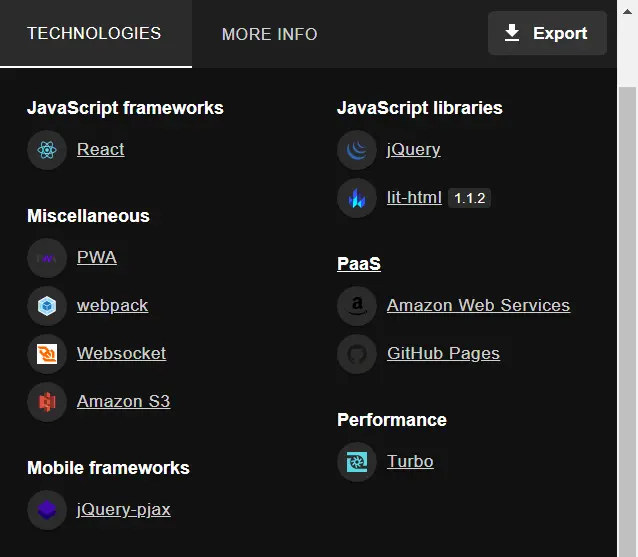

OK，从它给出的技术清单来看，我不知道的有**lit-html**、**Amazon S3**、**Turbo**这三个技术，于是我们只需要点进去看看即可。以**Turbo**为例，点进去之后，Wappalyzer简单的介绍了Turbo是干什么的，并且给出了官网链接。我知道了它是一个用来快速构建Web应用的JS框架。那么这个没听过的技术是不是很冷门呢？接着往下翻，它还列出了访问浏览最高的10个使用该技术的网站列表。

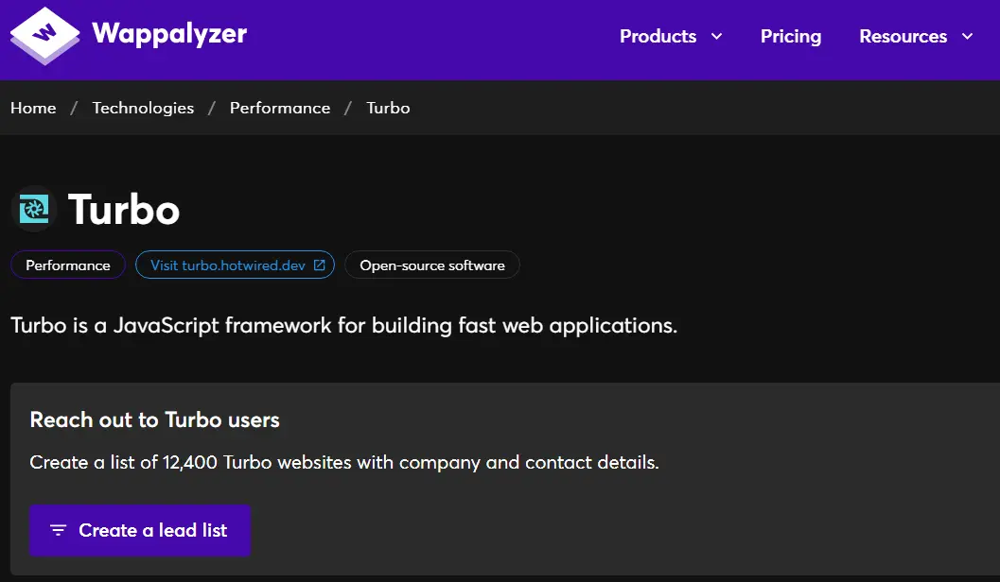

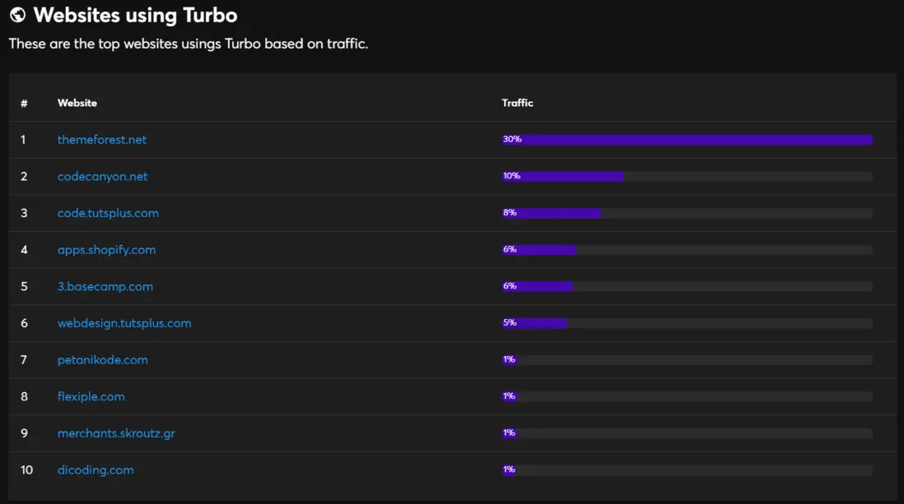

再来看看**Amazon S3**是什么？

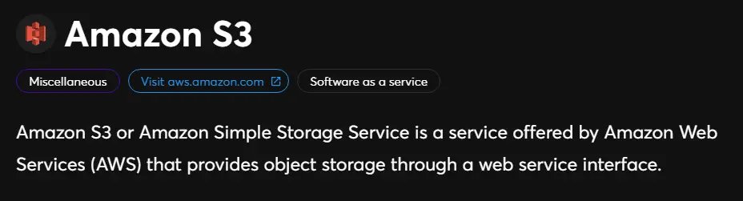

它是亚马逊的对象存储服务，接下来我们看看哪些网站使用了它。可以看到，使用它的都是非常出名的网站，包括了**linkedin、figma、notion、spotify**等等。足以说明亚马逊的对象存储是个很靠谱的服务，选择它没什么问题。
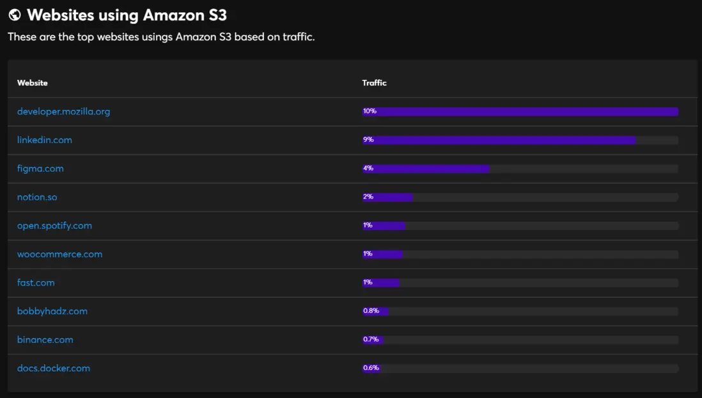

好了，以上我们用Github为例，简单介绍了**Wappalzer**的使用方法。大家可能会发现，其实列出的技术清单也并不是很多，这其实和你访问的网站密不可分，有些技术是很难被探测出来的。

## 三、横向对比同一领域使用的技术
第三个问题，当我了解到了一些我不知道的技术后，是否我就可以直接采用这项技术了呢？非也，一项技术的落地一定和整个生态链以及项目的整体技术架构息息相关。所以我们并不能单一地决定我们是否能采用这项技术。最好的办法之一，我们可以对相同类型的网站进行分析，看看他们对于单一功能是否使用了相同或不同的技术，以便于我们进行技术的分析和选择。

接下来我们以**StackoverFlow**和**Segmentfault**为例，两者都是问答类技术网站，使用人数都很多，那么我们对比一下他们使用的技术。

**Segmentfault**
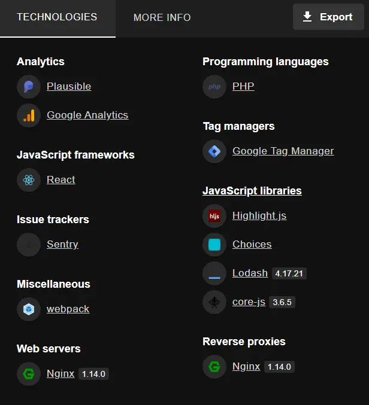

**StackoverFlow**

从上面两张图的技术清单来看，相同的技术有**Google Analytics、Webpack、Highlight.js、Google Tag Manager**。前端的技术我们就不说了，来看看这个**Google Tag Manager**是什么东东。它是一个标签管理系统(TMS)，允许在你的网站或移动应用程序上，快速和轻松地更新测量代码和相关代码片段作为标签。

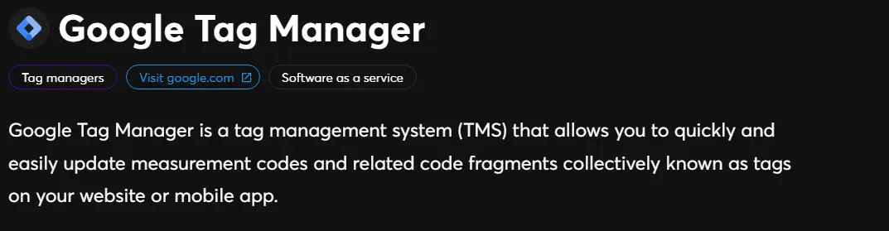

再来看看哪些网站使用了它
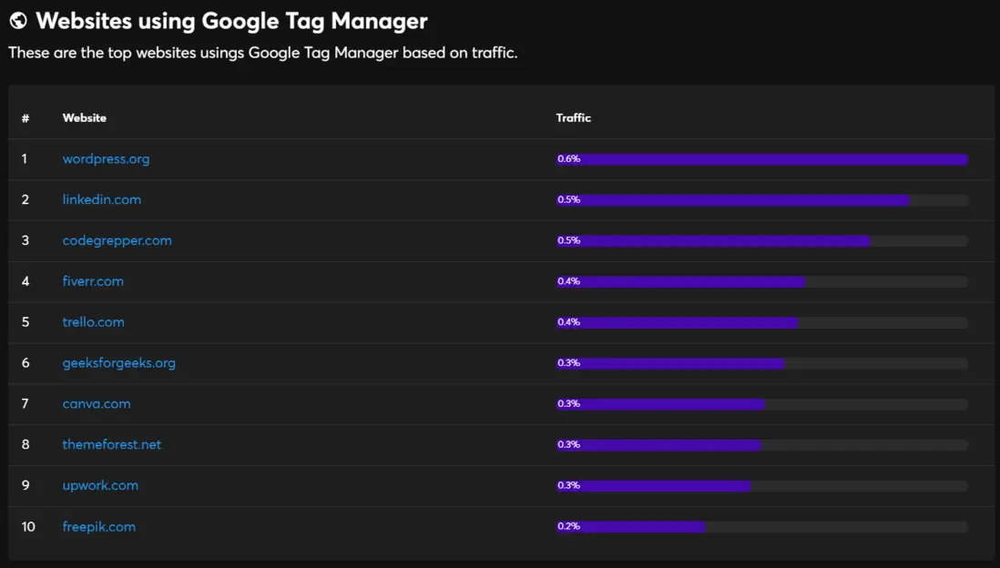

那么经过横向对比我们现在知道了，博客系统、招聘网站、问答类系统都在使用这个技术，如果你的系统也有类似打标签的功能，可以放心使用**Google Tag Manager**。

## 四、这项技术真的过时了吗？
第四个问题，我们都知道，前端工程化之后，随着各个前端框架的层出不穷，**jQuery**这项技术明显遭到了排挤和抹黑，甚至很多人看不起使用jQuery的前端，认为这是一种low的表现。作为一个经常使用jQuery的前端工程师，我想反驳却不知道从何反驳。这时Wappalzer成了我最好的帮手，我们只需要点开那些最出名的网站，看看是否还在使用jQuery即可。

之前我们已经看到Github、StackoverFlow都还在使用jQuery，那我们就点进去看看还有其他哪些网站在使用。

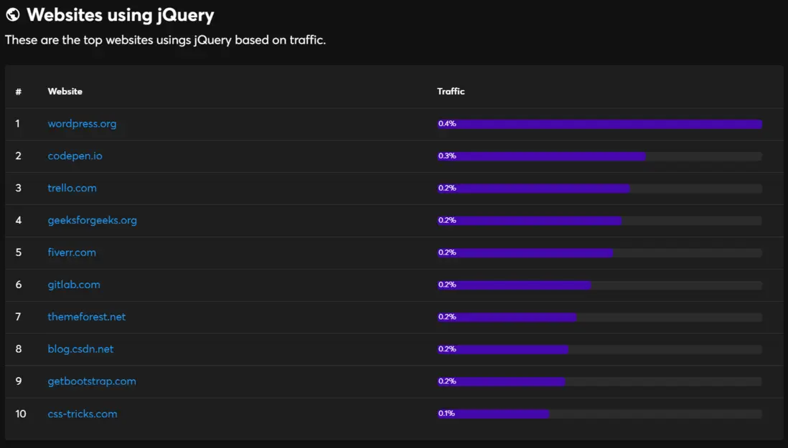

可以看到，**Wordpress、codeopen、gitlab、CSDN**等网站都在使用它，不管是历史遗留原因还是真的需要，都证明了**jQuery**这项技术并不过时。它的定位和现代前端框架本身就不同，不应该受到不公正的评价。

## 五、寻找替代品
**Wappalzer**还有个强大的功能，那就是列出了今年最火爆的替代技术，以刚刚的**Google Tag Manager**为例，看看它的替代品有哪些。

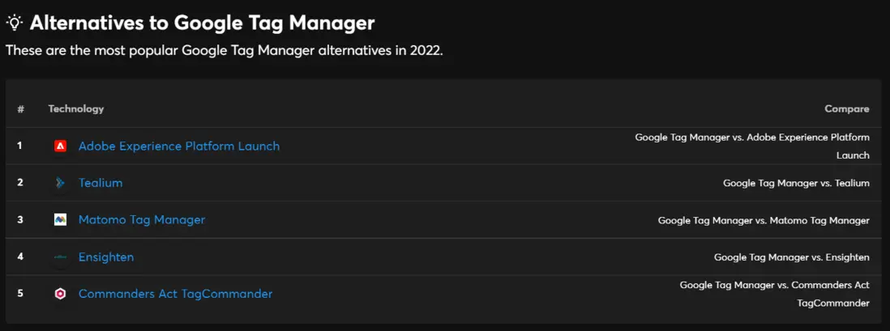

当我们点进某个替代品，会列出两个技术的对比项
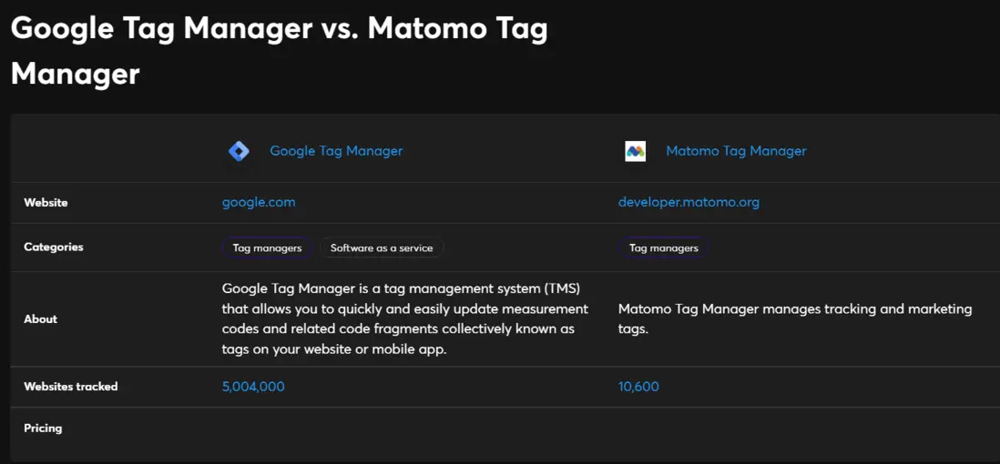
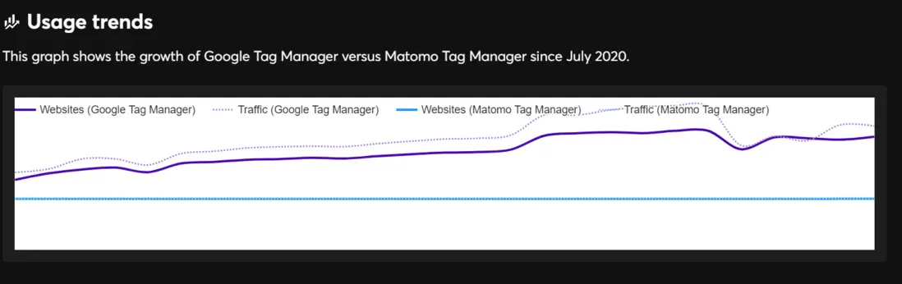

## 六、更多功能
Wappalzer还有其他非常多的功能，包括会告诉你这项技术哪些地区使用最多等。甚至还有收费功能，可以查到更多的技术细节。希望大家可以好好利用这项工具，打开自己的视野。

