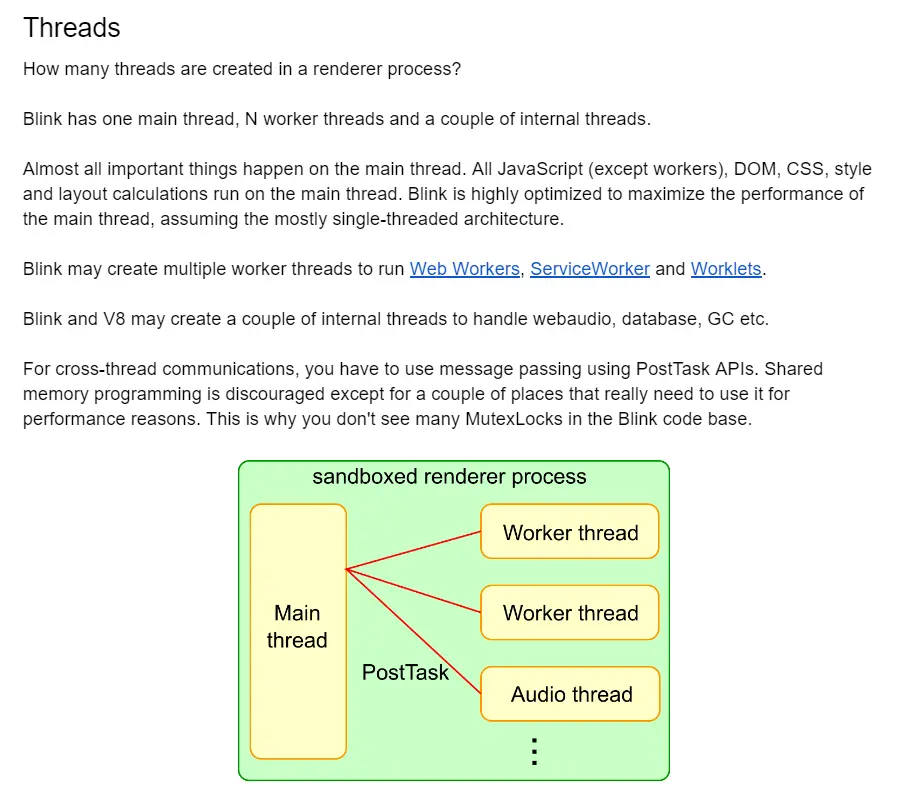
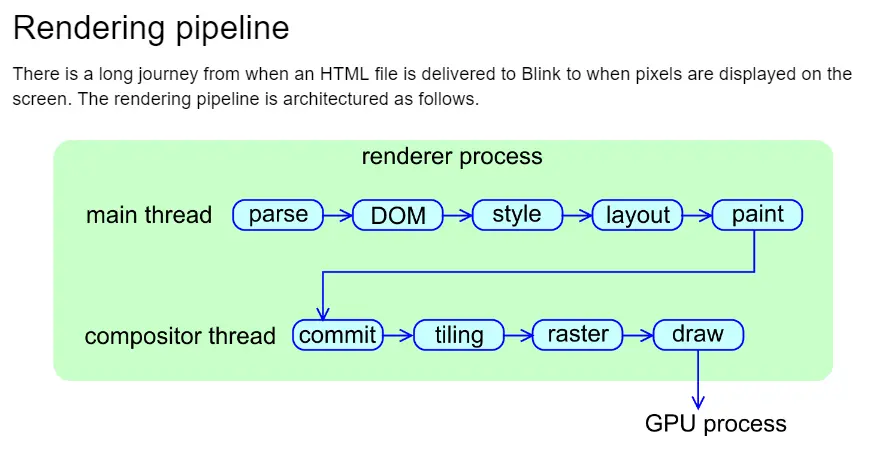
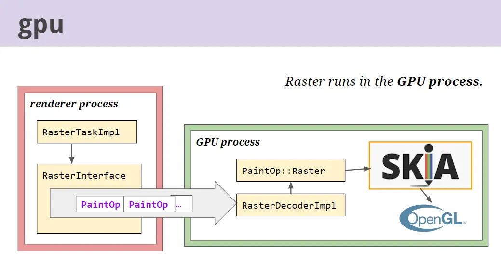
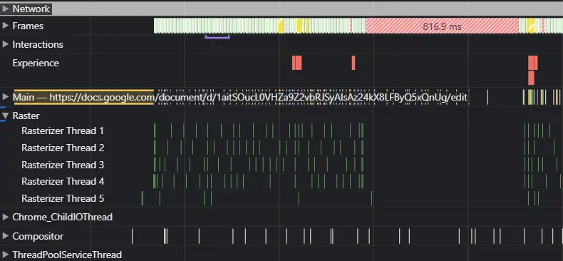
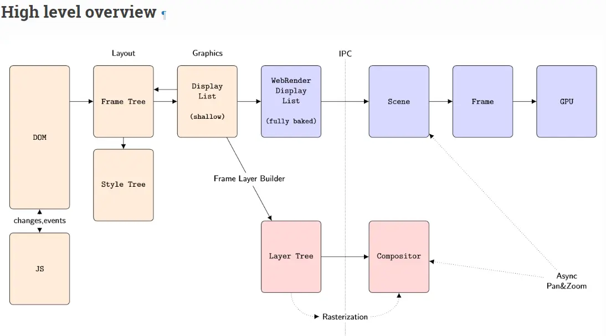

## 一、前言
以现在Chrome使用的渲染器Blink为例, 它也是Webkit下的一个分支。先贴出官方文档
> [How Blink works](https://docs.google.com/document/d/1aitSOucL0VHZa9Z2vbRJSyAIsAz24kX8LFByQ5xQnUg/edit#)

首先说明，我不会C++，所以并不能以自己构建过浏览器并研究里面的每一部分这种实践的方式来解释浏览器中的线程工作原理，我只能通过我已经了解过的，比较权威的文档来告诉大家。我贴出的所有文档都出自于Chromium官方文档中的链接。

## 二、Blink的线程机制

**接下来我们以官方视角用比较权威的途径来解读：**

首先明确Blink完成一个网页渲染需要做的事情：
1. 实现Web标准，也就是W3C和一些标准组织的规范。包括HTML、DOM、CSS等。
2. 嵌入V8引擎，执行JS
3. 请求网络资源
4. 构建DOM树
5. 计算样式和布局
6. 嵌入合成器，绘制图形

**然后我们来看看Blink有哪些线程：**

首先Blink渲染器会有一个主线程，其次会有N个Worker线程和一些内部线程。
**其中所有的js计算、DOM解析、CSS解析、样式和布局计算都是在主线程中完成的。**

那么这里就可以肯定一点，大部分的渲染工作都是在主线程中完成的（只有1个线程）。但是这个过程中并没有合成器和光栅化这些功能，因为他们都是在单独的线程。

## 三、渲染过程

提到合成器，就需要说到整个渲染流程，其实就是下图所示的流程。可以看到，在主线程完成到布局计算之后，进行真正的页面绘制是通过合成线程来完成的。那么这里就已经出现2个主要的线程了，主线程与合成线程。下图中可以看到在合成的过程中，出现了raster，也就是光栅化的过程。

鉴于文档可能并没有说完全，我们需要找更多文档来佐证这样的描述是否正确。
> [Life of a Pixel](https://docs.google.com/presentation/d/1boPxbgNrTU0ddsc144rcXayGA_WF53k96imRH8Mp34Y/edit#slide=id.ga884fe665f_64_906)

这篇文档中也提到了，在paint之后即是raster，raster是在GPU进程中完成的。网上的资料又查到raster是一个线程池，关于这个说法我没找到官方的描述，于是我们可以打开F12，使用Performance来印证一下，发现确实如此。

## 四、印证结果

通过Performance的印证，目前我们发现了三个主要线程（Raster为线程池），Main/Compositor/Raster。
但是很明显我们在Performance中还能看到Chrome_ChildIOThread等其他线程，但是从官方文档来看，至少涉及到渲染的进程，我们可以总结出3个：即主线程，合成器线程，光栅化线程池。

至于其余的网络请求/IO/Frame等线程，是如何工作的以及作用面有多广，暂时没有研究过。

## 五、Gecko

还有Firfox的Gecko渲染器，可以参考下

> [FireFox Rendering Overview](https://firefox-source-docs.mozilla.org/gfx/RenderingOverview.html)

