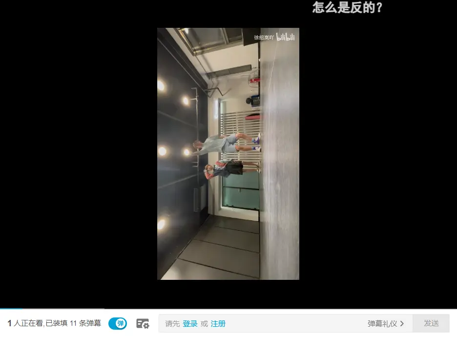
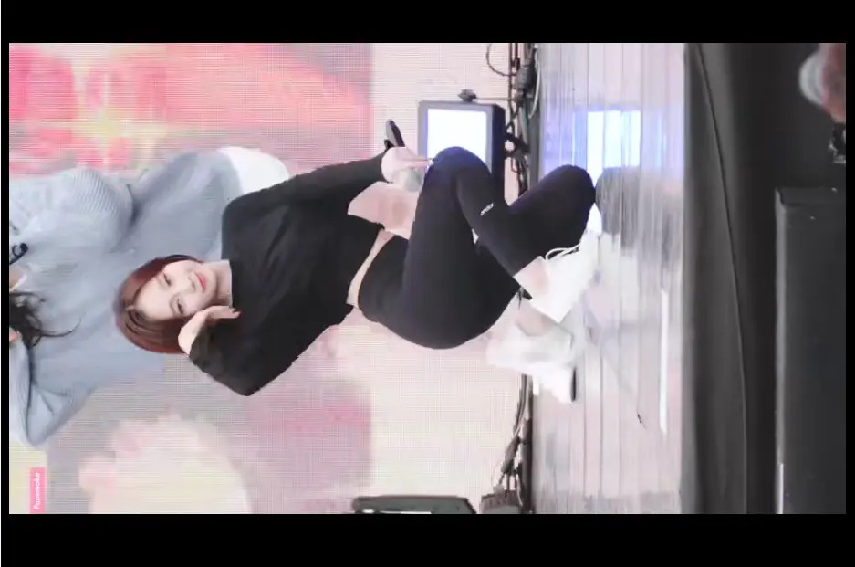

# Video Roll

  

[Chrome Web Store](https://chrome.google.com/webstore/detail/video-roll/cokngoholafkeghnhhdlmiadlojpindm?hl=zh-CN&authuser=0 "Chrome Web Store")  / [Github](https://github.com/gxy5202/ "Github")

### 主要特性

-   采用最新 extension V3 标准开发
-   可旋转任何网页中的 HTML5 视频
-   针对播放器使用 Web components 或 Shadow dom 的网站做了特别优化（P 站、B 站）
-   旋转视频时，会自动根据视频容器和视频原始大小尺寸进行自适应
-   轻量级插件，小于 100kb
-   重视安全性，插件不会收集任何用户信息，仅会使用 tab API 读取当前网页地址

### 使用场景
移动端不需要，因为手机全屏自带旋转功能，无论视频是横屏还是竖屏，都不需要。

但是在PC端，很多依赖UP主上传视频的网站，会存在横屏变竖屏，竖屏变横屏的情况。以B站举例，例如下面这样的视频还不少：

除了B站，P站、某1等都依赖用户上传视频的网站都是重灾区。

问题就出在这，网页端的HTML视频播放器基本都没有提供旋转视频的功能，有点拉跨。于是这款插件就诞生了，它可以帮你旋转视频角度，同时会根据视频的容器自适应视频大小。

网上也有其他类似的插件，但是基本在B站就没用了，因为B站用的自己封装的Shadow Dom，而不是video标签，于是一众插件都失灵了。Video Roll则针对P站和B站做了特别处理，保证能够正常旋转。

### 安装

---

-   **crx 安装**： [Chrome Web Store](https://chrome.google.com/webstore/detail/video-roll/cokngoholafkeghnhhdlmiadlojpindm?hl=zh-CN&authuser=0 "Chrome Web Store") 
    在谷歌应用商店或非官方商店直接下载该插件安装即可（由于谷歌对于新开发者采取信任制策略，可能需要数个月才能进入信任名单，如提示不信任，需要点击确认安装）

-   **开发模式安装**
    如您无法安装 crx，可以在浏览器的扩展程序中开启“开发者模式”，直接将 dist 文件夹拖入安装即可。

### 问题反馈

---

若您在使用中遇到任何问题，比如 bug 或者网站有特殊的视频元素无法旋转，请在 issue 中留下问题，我们会尽快解决

