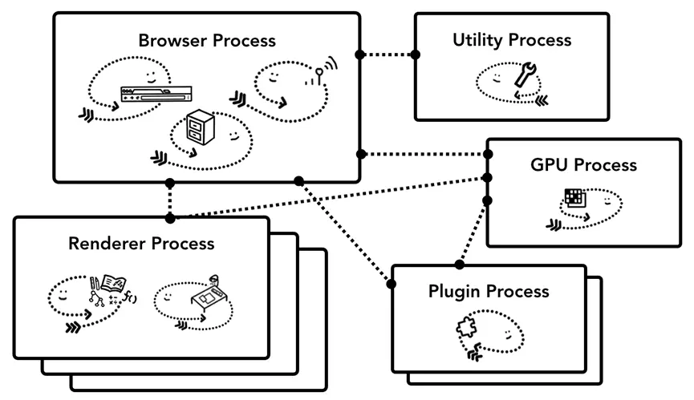
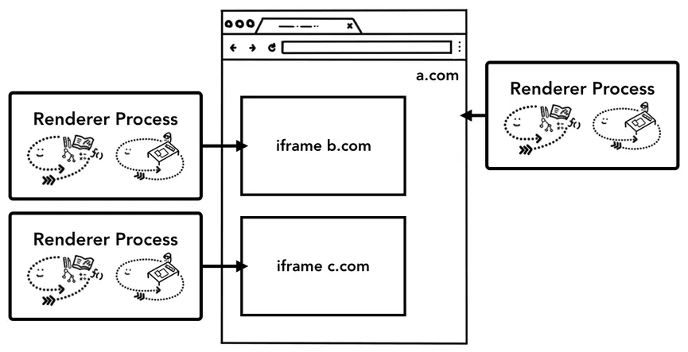

>  本文翻译自[Inside look at modern web browser (part 1)](https://developers.google.com/web/updates/2018/09/inside-browser-part1)
原文作者：[Mariko Kosaka](https://developers.google.com/web/resources/contributors/kosamari)
翻译：[Gomi](https://gomi.site/#/)

## CPU，GPU，内存以及多进程架构
在这个系列中，我们将会从高层架构的角度深入到Chrome浏览器渲染流程的具体细节。如果你想知道浏览器是如何将你的代码变成一个可用的网站，亦或者你不清楚为何会建议你使用特定的技术来提高网站的性能，那么本系列适合你。

作为本系列的第 1 部分，我们将了解核心计算术语和 Chrome 的多进程架构。
> 如果你熟悉CPU/GPU和进程/线程，你可以跳到[浏览器架构](https://developers.google.com/web/updates/2018/09/inside-browser-part1#browser-architecture)

## 一、计算机的核心：CPU和GPU
为了了解浏览器的运行环境，我们需要了解一些计算机部件以及它们的作用。

### CPU
首先是**中央处理器**（CPU）。CPU可以看作是计算机的大脑。一颗CPU内核，在此图中被描绘成一个办公室员工，当任务出现时，它能一个一个地处理许多不同的任务。它可以处理从数学到艺术的所有事情，同时知道如何回复客户的电话。在过去，大多数CPU都是单芯片的。内核就像另一个CPU生活在同一个芯片中。在现代硬件中，你通常会得到多个内核，从而为你的手机和笔记本电脑提供更强的计算能力。

**图1：4个CPU内核作为办公室工作人员坐在每张办公桌前处理进来的任务**

### GPU
**图形处理器**（GPU）是计算机的另一部分。与CPU不同，GPU擅长处理简单的任务，但可以同时跨多个内核。顾名思义，它最初是为处理图形而开发的。这就是为什么在图形上下文（可能是指电脑的GPU选项）中“使用GPU”或“GPU支持”与快速渲染和流畅交互有关。近年来，随着GPU加速图像处理技术的发展，越来越多的计算在GPU上成为了可能。

**图2：许多带有扳手的GPU内核表明它们只能处理有限的任务**

当你在计算机或手机上启动应用程序时，CPU和GPU是驱动程序的核心。大部分情况下，应用程序会根据操作系统提供的机制运行在CPU和GPU上。

**图3：三层计算机架构。机器硬件在底层，操作系统在中间，应用程序在顶层**

## 二、在进程和线程上执行程序
在深入研究浏览器架构之前要掌握的另一个概念是进程和线程。进程可以描述为应用程序的执行程序。线程是存在于进程内部并执行其进程程序的任何部分的线程。

当你启动应用程序时，计算机会创建一个进程。该程序可能会创建线程来帮助它工作，但这是可选的。操作系统为进程提供了一块可使用的内存“平板”，所有应用程序状态都保存在该私有内存空间中。当你关闭应用程序时，该进程也会消失，并且操作系统会释放内存。

**图4：进程作为边界框，线程作为抽象的鱼在进程内游动**

**图5：使用内存空间和存储应用程序数据的进程图**

一个进程可以要求操作系统启动另一个进程来运行不同的任务。发生这种情况时，将为新进程分配内存的不同部分。如果两个进程需要通信，它们可以使用进程间通信(IPC)来实现。许多应用程序被设计为以这种方式工作，因此，如果一个进程没有响应，它不会影响其他运行在不同应用程序上的进程，然后重新启动。

**图6：通过IPC进行通信的独立进程示意图**

## 三、浏览器架构
那么如何使用进程和线程构建Web浏览器呢？好吧，它可能是一个具有许多不同线程的进程，也可能是许多不同的进程，其中有几个线程通过IPC进行通信。

**图7：进程/线程图中的不同浏览器架构**

这里要着重注意的是，图中这些不同的架构是实现细节，并没有关于如何构建 Web 浏览器的标准规范，一种浏览器的构建可能与另一种完全不同。

接下来我们将使用下图中描述的Chrome的最新架构。

顶部是浏览器进程与处理应用程序不同部分的其他进程协调。对于渲染器进程，会创建多个进程并将其分配给每个网页。直到最近，Chrome还在可能的情况下为每个网页提供了一个进程；现在Chrome尝试为每个站点提供自己的进程，包括iframes（[站点隔离]。(https://developers.google.com/web/updates/2018/09/inside-browser-part1#site-isolation)）

**图8：Chrome的多进程架构图。渲染器进程下显示了多个图层，以表示Chrome为每个选项卡运行多个渲染器进程**

## 四、每个进程对应控制的部分
下表描述了每个Chrome进程及其控制的内容：

| ----- | ----- |
| 浏览器进程 | 控制“chrome”应用程序部分，包括地址栏、书签、后退和前进按钮。还处理浏览器中不可见的特权部分，例如网络请求和文件访问 |
| 渲染器进程 | 控制显示网页内的任何显示的内容 |
| 插件（plugin）进程 | 控制网站使用的任何插件，例如Flash |
| GPU进程 | 独立于其他进程，处理GPU任务。它被分成不同的进程，因为GPU处理来自多个应用程序的请求并将它们绘制在同一个表面上。 |
| 浏览器插件（Extension）进程 | 控制浏览器插件，比如油猴、Vue Devtools等 |
| 实用程序进程 | 控制一些其他实用程序的进程，比如V8代理解析工具，音频服务等 |

**图9：指向浏览器 UI 不同部分的不同进程**

## 五、Chrome中多进程架构的好处
之前，我提到Chrome使用多个渲染器进程。在最简单的情况下，你可以想象每个网页都有自己的渲染器进程。假设你打开了3个网页，每个网页都由一个独立的渲染器进程运行。如果一个网页变得无响应，那么你可以关闭无响应的网页并继续下一步，同时保持其他网页处于活动状态。如果所有网页都在一个进程上运行，则当一个网页无响应时，所有网页均无响应，这很悲剧。

**图10：显示运行每个选项卡的多个进程的图表**

将浏览器的工作划分成多个进程的另一个好处，是安全性和隔离性。由于操作系统提供了一种限制进程权限的方法，因此浏览器可以从某些功能对某些进程进行沙箱化处理。例如，Chrome浏览器对那些处理用户输入的进程（如渲染器进程），限制了文件的访问权限。

因为进程有自己的私有内存空间，它们通常包含通用基础设施的副本（例如V8，它是Chrome的 JavaScript引擎）。这意味着更多的内存使用，因为它们不能像在同一进程中的线程那样共享。为了节省内存，Chrome限制了它可以启动的进程数。这种限制取决于你的设备拥有多少内存和CPU处理能力，但是当Chrome达到极限时，它会开始在一个进程中运行来自同一站点的多个网页页签。

## 六、节省更多的内存 - Chrome中的服务化
相同的方法适用于浏览器进程。 Chrome正在经历架构更改，以将浏览器程序的每个部分作为服务运行，从而可以轻松拆分为不同的进程或聚合为一个。

一般的想法是，当Chrome在强大的硬件上运行时，它可能会将每个服务拆分为不同的进程以提供更高的稳定性，但如果它在资源受限的设备上，Chrome会将服务整合到一个进程中以节省内存占用。在此更改之前，已在Android等平台上使用了类似的整合流程方法来减少内存的使用。

**图11：Chrome的服务化图将不同的服务移动到多个进程和单个浏览器进程中**

## 七、帧渲染器进程 - 站点隔离
站点隔离是Chrome中最近引入的一项功能，它为每个跨站点iframe运行单独的渲染器进程。我们一直在讨论每个网页页签一个渲染器进程，它允许跨站点iframe在单个渲染器进程中运行，并在不同站点之间共享内存空间。在同一个渲染器进程中运行a.com和b.com似乎没问题。同源策略是网络的核心安全模型；它确保一个站点在未经同意的情况下无法访问其他站点的数据。绕过此策略是安全攻击的主要目标。进程隔离是分隔站点的最有效方法。由于Meltdown和Spectre（安全漏洞）的出现，我们更加需要使用不同的进程来隔离站点。自Chrome 67起，默认情况下在桌面上启用站点隔离，网页中的每个跨站点iframe都会获得一个单独的渲染器进程。

**图12：站点隔离示意图；指向站点内 iframe 的多个渲染器进程**

启用站点隔离是一项多年的工程工作。 站点隔离并不像分配不同的渲染器进程那么简单； 它从根本上改变了iframe相互通信的方式。 从不同进程上运行iframe的页面，打开devtools，意味着 devtools必须执行后台任务以使其看起来无缝集成。 即使运行一个简单的Ctrl+F在页面中查找单词，也意味着在不同的渲染器进程中进行搜索。 这就是为什么浏览器工程师会将“站点隔离”的发布称为重要里程碑的原因！

## 八、总结
在这篇文章中，我们从一个更高的视角介绍了浏览器架构，并介绍了多进程架构的好处。 我们还介绍了与多进程架构密切相关的Chrome中的服务化和站点隔离。 在下一篇文章中，我们将开始深入研究，为了成功展示一个网站，这些进程和线程之间发生了哪些事情。