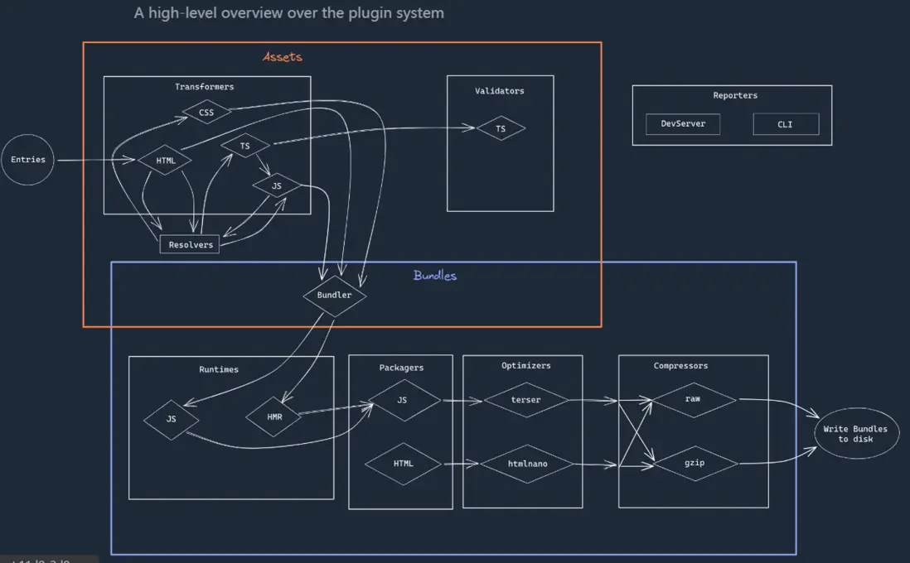
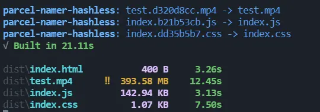

## 一、前言
Parcel2的问世，极大提高了打包的灵活度，但是parcel2在打包时，会根据打包文件的依赖关系和parcel的配置，决定是否给文件添加唯一的hash值。例如`index.js`打包后可能会变成`index.794a6267.js`。那么如何根据我们的需要决定是否要加上hash值呢？

## 二、Parcel2 content hashing
在parcel2的介绍中，有个重要的特性，就是`content hashing`。它是干什么的呢？Parcel在build文件时，会自动根据文件内容生成hash值，主要是为了给浏览器做缓存使用。当你的文件内容发生变化后，hash值也会相应变化，浏览器就会加载最新的文件。如果hash值没有发生变化，则浏览器会使用缓存的文件。

默认情况下，parcel会自动给依赖的文件加上对应的hash值，除了一些入口文件如index.html或者依赖库文件等，需要稳定的文件名，不会添加hash值外，其他文件parcel会自动判断是否需要添加hash值。

如果你想在每次打包时使文件名固定，可以在parcel打包命令后加上`--no-content-hash`：
```
"build:popup": "parcel build src/index.html --no-source-maps --no-content-hash"
```

但这种方式并不会去掉文件名后的hash值，而只是让这个hash值始终不会变化。

## 三、为何需要去掉hash值
一般情况下，比如我们用`vue`或者`react`写web端的网站，这种单页应用，往往就1个入口文件，其余的所有css或者js都是在框架层之中会被处理掉，我们也不需要关心这些文件打包后的名称，所以这些文件都被加上hash值，对于缓存更友好，我们无需再去关心。

但存在另一种情况，当我们不是单纯的写1个网页，可能是写一个`web extension`，或者其他工具等，这些东西的文件结构往往都是相对固定的，且存在官方要求的配置文件，需要你明确指定每个功能对应的是什么文件名（比如wen extentsion）。那么这种情况我们就不能给这些文件加上hash值，即使这个hash值始终是固定的，但由于我们无法预知这个hash值是什么，所以在配置文件中我们就没法写固定的文件名了。

## 四、插件系统 Plugin
针对这种情况，parcel提供了一种解决方案，如果对于parcel自动生成的文件名无法满足需求，则可以通过plugin来修改每个打包后的文件名。parcel将plugin分为了许多模块，有`transformers`(比如针对vue文件做转换)，有`Namers`(针对文件名做处理)等等，每个插件负责的功能不同，执行时机也不同。`Namers`插件就是在打包完成后执行的，允许你自定义修改文件名。


Namers插件使用方法如下：
在`.parcelrc`文件中，添加`namers`字段，然后添加插件名称（必须要`extends`一个基础插件@`parcel/config-default`）
```
/* .parcelrc */
{
  "extends": ["@parcel/config-default"],
  "namers": ["parcel-namer-hashless"]
}
```

## 四、使用parcel-namer-hashless插件去掉hash值
[parcel-namer-hashless](https://www.npmjs.com/package/parcel-namer-hashless)是1个无需多余配置，安装后即可在parcel打包文件后，去掉所有文件hash值的一个插件。

**使用：**
1.安装
```
npm install --save-dev parcel-namer-hashless
```
2.配置文件添加插件
```
/* .parcelrc */
{
  "extends": ["@parcel/config-default"],
  "namers": ["parcel-namer-hashless"]
}
```
3.如果打包的文件是`index.html`入口，在`package.json`中添加`source`字段
```
/* package.json */
{
  "source": "src/index.html"
}
```
4.如果你处于`development`模式中，插件不会去掉文件hash值，只会在`build`时去掉
5.当插件成功运行时，会在终端打印以下信息
```
parcel-namer-hashless: index.794a6267.js -> index.js
```


如果这个插件对你有帮助，欢迎star或提issue
https://github.com/gxy5202/parcel-namer-hashless