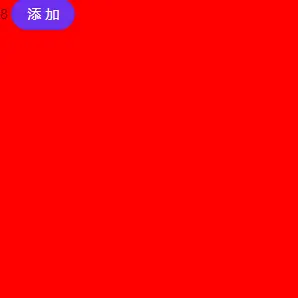

## 前言
vue3.0已经出了一段时间了，网上也有大量的实践教程可供参考。但从实际出发，由于开发的chrome插件需要升级到vue3.0，同时准备换上ant-design-vue，由于没有使用vue-cli脚手架，在这个升级过程中还是踩了不少坑，于是将自己搭建整个项目的过程记录下来，如对大家有帮助，避免少踩坑也是极好的。(没有vue-router是因为chrome插件用不上)

该文章记录日期为**2020年11月23日**，但项目实际搭建日期应该是在一周前左右。由于目前vue3.0刚出不久，包括其配套生态也还处于beta版本或者刚出RC版，后续可能出现一些变动，该实践仅作为目前版本的参考。

顺带一提，若想用上vue3.0下比较成熟的UI框架，目前除了ant-design-vue和vant并没有太多选择，如Vuetify，Quasar等优秀的UI框架都还没适配vue3.0，可以耐心等一等。

## 一、webpack5基础环境配置
**1.在项目下新建一个package.json配置文件**
```
npm init -y
```

**2.安装webpack5，webpack-cli和webpack-dev-server**
> *说明一下，就在4天前和19天前，webpack和webpack-cli又更新了版本，webpack为5.6.0, webpack-cli为4.2.0。而我搭建时的版本为webpack 5.4.0*

```
npm i webpack webpack-cli webpack-dev-server -D
```

这里出现第一个坑，webpack-cli若为4.2.0版本，使用webpack-dev-server会报错`Error: Cannot find module 'webpack-cli/bin/config-yargs'`，由于版本之间不兼容造成。
***解决方式，暂时将webpack-cli版本降为3.3.12***

**3.安装所需依赖**
> **Less和CSS**
由于我们使用了ant-design, CSS预编译就用less。
```
npm i less less-loader css-loader style-loader -D
```
> **TypeScript**

```
npm i typescript ts-loader -D
```
> **Babel**
```
npm i @babel/core @babel/preset-env @babel/plugin-transform-runtime babel-loader babel-plugin-import -D
```
```
npm i @babel/runtime -S
```
> **Vue和Vuex(指定版本)**
```
npm i vue@next vuex@4.0.0-rc.1
```
这里遇见第二个坑，之前的`vue-template-compiler`模板编译在这个版本会报错，改用`@vue/compiler-sfc`
```
npm i vue-loader@16.0.0-rc.1 @vue/compiler-sfc -D
```
> **Ant-design-vue(需指定版本)**
```
npm i ant-design-vue@2.0.0-beta.15 -S
```
> **相关webpack插件**
```
npm i clean-webpack-plugin copy-webpack-plugin html-webpack-plugin mini-css-extract-plugin -D
```

## 二、新建项目文件
> **文件目录**
    --index.html
    --src
        --main.ts
        --shims-vue.d.ts
        --pages
            --App.vue
        --store
            --Actions.ts
            --Getters.ts
            --Mutations.ts
            --State.ts
            --index.ts
        --assets
            --imgs
                --xxx.png
    --tsconfig.json
    --webpack.dev.config.js
    --webpack.prod.config.js
    --package.json
> **index.html**
```
<!DOCTYPE html>
<html lang="en">

<head>
    <meta charset="UTF-8">
    <meta name="viewport" content="width=device-width, initial-scale=1.0">
    <title>Document</title>
</head>

<body>
    <div id="app"></div>
</body>

</html>
```
> **main.ts**
```
import { createApp } from "vue";
import box from "./pages/App.vue";
import store from './store';
import Button from 'ant-design-vue/lib/Button';
import 'ant-design-vue/dist/antd.less';

const app = createApp(box);
app.use(store).use(Button).mount('#app');
```
> **store/index.ts**
```
import { createStore } from 'vuex';
import state from './State';
import mutations from './Mutations';
import actions from './Actions';
import getters from './Getters';

const store = createStore({
    state,
    mutations,
    actions,
    getters
})

export default store;
```
> **store/Mutations.ts**
```
interface mutationObj {
    addCount: Function,
    [propName: string]: any
}

const mutations: mutationObj = {
    addCount(state) {
        state.counter += 1;
    }
}

export default mutations;
```
> **store/State.ts**
```
interface stateObj {
    counter: number,
    [propName: string]: any
}

const state: stateObj = {
    counter: 0
}

export default state;
```
> **App.vue**
```
<template>
	<div class="box">
		{{ counter }}
		<a-button type="primary" @click="addCount">添加</a-button>
	</div>
</template>

<script lang="ts">
import { computed } from "vue";
import { useStore } from "vuex";
export default {
	name: "App",
	// 组合API函数入口
	setup() {
		const store: any = useStore();

		const counter = computed(() => {
			return store.state.counter;
		});

		const addCount = () => {
			store.commit("addCount");
		};

		return { counter, addCount };
	},
};
</script>

<style lang="less" scoped>
.box {
	width: 300px;
	height: 300px;
	background: red;
}
</style>
```
## 三、配置文件
>** webpack.dev.config.js**
```
const path = require('path');
const { HotModuleReplacementPlugin, IgnorePlugin } = require('webpack');
const { CleanWebpackPlugin } = require('clean-webpack-plugin');
const HtmlWebpackPlugin = require('html-webpack-plugin');
const { VueLoaderPlugin } = require('vue-loader');

const config = {
    mode: 'development',
    entry: './src/main.ts',
    output: {
        filename: 'index.js',
        path: path.resolve(__dirname, 'dist')
    },
    devServer: {
        contentBase: false,
        // publicPath: './dist',
        hot: true,
        port: 8080,
        open: true,
        // hotOnly: true,
        compress: true,
        overlay: true
    },
    watchOptions: {
        ignored: /node_modules/
    },
    plugins: [
        new CleanWebpackPlugin(),
        new HtmlWebpackPlugin({
            title: 'Hot Module Replacement',
            template: 'index.html'
        }),
        new IgnorePlugin(/^\.\/locale$/, /moment$/),
        new HotModuleReplacementPlugin(),
        new VueLoaderPlugin()
    ],
    module: {
        rules: [
            // babel使用runtime，避免将不需要的代码注入
            {
                test: /\.js$/,
                exclude: /node_modules/,
                use: [{
                    loader: 'babel-loader',
                    options: {
                        // cacheDirectory: true,
                        presets: ['@babel/preset-env'],
                        plugins: [
                            '@babel/plugin-transform-runtime',
                            ['import', {
                                "libraryName": "antd",
                                "style": true,   // or 'css'
                            }, 'antd']
                        ]
                    }
                }],
            },
            {
                test: /\.ts$/,
                exclude: /node_modules/,
                use: [
                    {
                        loader: 'ts-loader',
                        options: {
                            // 指定特定的ts编译配置，为了区分脚本的ts配置
                            configFile: path.resolve(__dirname, './tsconfig.json'),
                            appendTsSuffixTo: [/\.vue$/]
                        }
                    }
                ]
            },
            {
                test: /\.vue$/,
                loader: 'vue-loader'
            },
            {
                test: /\.css$/,
                use: ['style-loader', 'css-loader']
            },
            {
                test: /\.less$/,
                use: ['style-loader', 'css-loader',
                    {
                        loader: 'less-loader',
                        options: {
                            lessOptions: {
                                modifyVars: {
                                    'primary-color': '#4608e2',
                                    'link-color': '#4608e2',
                                    'border-radius-base': '20px',
                                },
                                javascriptEnabled: true,
                            }
                        }
                    }],
            }
        ]
    },
    resolve: {
        extensions: ['.js', '.ts']
    },
};


module.exports = (env) => {
    console.log(`当前执行${env.mode}模式`);
    return config;
}
```
> **webpack.prod.config.js**
```
const path = require('path');
const { CleanWebpackPlugin } = require('clean-webpack-plugin');
const HtmlWebpackPlugin = require('html-webpack-plugin');
const CopyWebpackPlugin = require('copy-webpack-plugin');
const MiniCssExtractPlugin = require('mini-css-extract-plugin');
const { VueLoaderPlugin } = require('vue-loader');

const config = {
    mode: 'production',
    entry: './src/main.ts',
    output: {
        filename: 'index.js',
        path: path.resolve(__dirname, 'dist')
    },
    plugins: [
        new CleanWebpackPlugin(),
        new HtmlWebpackPlugin({
            title: 'Hot Module Replacement',
            template: 'index.html'
        }),
        new CopyWebpackPlugin({
            patterns: [
                {
                    from: 'src/assets',
                    to: 'assets'
                },
            ]
        }),
        new MiniCssExtractPlugin({
            filename: './index.css'
        }),
        new VueLoaderPlugin()
    ],
    module: {
        rules: [
            // babel使用runtime，避免将不需要的代码注入
            {
                test: /\.js$/,
                exclude: /node_modules/,
                use: [{
                    loader: 'babel-loader',
                    options: {
                        cacheDirectory: true,
                        presets: ['@babel/preset-env'],
                        plugins: [
                            ['import', {
                                "libraryName": "antd",
                                "style": true,   // or 'css'
                            }, 'antd']
                        ]
                    }
                }],
            },
            {
                test: /\.ts$/,
                exclude: /node_modules/,
                use: [
                    {
                        loader: 'ts-loader',
                        options: {
                            // 指定特定的ts编译配置，为了区分脚本的ts配置
                            configFile: path.resolve(__dirname, './tsconfig.json'),
                            appendTsSuffixTo: [/\.vue$/]
                        }
                    }
                ]
            },
            {
                test: /\.vue$/,
                use: ['vue-loader']
            },
            {
                test: /\.css$/,
                use: [MiniCssExtractPlugin.loader, 'css-loader']
            },
            {
                test: /\.less$/,
                use: [MiniCssExtractPlugin.loader, 'css-loader', {
                    loader: 'less-loader',
                    options: {
                        lessOptions: {
                            modifyVars: {
                                'primary-color': '#4608e2',
                                'link-color': '#4608e2',
                                'border-radius-base': '20px',
                            },
                            javascriptEnabled: true,
                        }
                    }
                }]
            }
        ]
    },
    resolve: {
        extensions: ['.js', '.ts']
    },
};

module.exports = (env) => {
    console.log(`当前执行${env.mode}模式`);
    return config;
}
```
> **tsconfig.json**
```
{
    "compilerOptions": {
        // "esModuleInterop": true,
        "incremental": true, // 增量编译
        "allowJs": true,
        "lib": [
            "es6",
            "dom",
            "es2017"
        ],
        "types": []
    },
    "exclude": [
        "node_modules"
    ]
}
```
> **shims-vue.d.ts**
```
declare module '*.vue' {
    import Vue from 'vue';
    export default Vue;
}

declare module "vue/types/vue" {
    interface Vue {
        $http: any;
        $Message: any;
        $Modal: any;
    }
}
```
> **package.json**
```
{
  "name": "test",
  "version": "1.0.0",
  "description": "",
  "main": "index.js",
  "scripts": {
    "test": "echo \"Error: no test specified\" && exit 1",
    "start": "webpack-dev-server --config webpack.dev.config.js --env.mode development --watch --profile",
    "build": "webpack --config webpack.prod.config.js --env.mode production"
  },
  "keywords": [],
  "author": "",
  "license": "ISC",
  "devDependencies": {
    "@babel/core": "^7.12.9",
    "@babel/plugin-transform-runtime": "^7.12.1",
    "@babel/preset-env": "^7.12.7",
    "@vue/compiler-sfc": "^3.0.2",
    "babel-loader": "^8.2.1",
    "babel-plugin-import": "^1.13.3",
    "clean-webpack-plugin": "^3.0.0",
    "copy-webpack-plugin": "^6.3.2",
    "css-loader": "^5.0.1",
    "html-webpack-plugin": "^4.5.0",
    "less": "^3.12.2",
    "less-loader": "^7.1.0",
    "mini-css-extract-plugin": "^1.3.1",
    "style-loader": "^2.0.0",
    "ts-loader": "^8.0.11",
    "typescript": "^4.1.2",
    "vue-loader": "^16.0.0-rc.1",
    "webpack": "^5.6.0",
    "webpack-cli": "^3.3.12",
    "webpack-dev-server": "^3.11.0"
  },
  "dependencies": {
    "@babel/runtime": "^7.12.5",
    "ant-design-vue": "^2.0.0-beta.15",
    "vue": "^3.0.2",
    "vuex": "^4.0.0-rc.1"
  }
}
```
## 四、命令执行
> **开发环境**
```
npm start
```
> **生产环境**
```
npm run build
```
## 五、最终效果


## 六、结语
这个项目搭建的案例，只做了最简单的示例，就是利用vuex做一个计数器。其实chrome插件会有多个入口文件，最终打包出来的文件结构和开发时还是有所区别，后面会单独写篇文章介绍。

我将该示例放在了github上，欢迎食用~
https://github.com/gxy5202/webpack5-vue3.0-vuex-ant-deisgn-vue